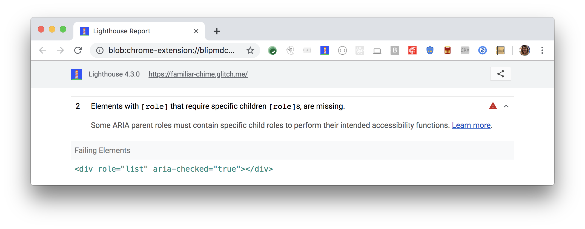

[ARIA](https://www.w3.org/TR/wai-aria-1.1/#role_definitions)
roles and attributes help screen readers
provide missing information about an element.
For these roles and attributes to make sense,
each ARIA `role` supports a specific subset of `aria-*` attributes
(see [ARIA roles definitions](https://www.w3.org/TR/wai-aria-1.1/#role_definitions)).
Some ARIA roles have required attributes that describe the state of the element to screen readers. 
Lighthouse reports a role's missing required states and properties:

<figure class="w-figure">
  
  <figcaption class="w-figcaption">
    Fig. 1 — ARIA role missing required states and properties
  </figcaption>
</figure>



## How Lighthouse identifies missing required states and properties

Lighthouse uses the
[WAI ARIA specification - Definition of roles](https://www.w3.org/TR/wai-aria-1.1/#role_definitions)
to check for a role's required attributes.
Any role that contains "required states and properties",
must have the required state and property defined.
Lighthouse fails this audit,
when it finds a role is missing it's required state and property.

## How this audit impacts overall Lighthouse score

Lighthouse flags this as a low severity issue.
It is important to fix, and
probably indicates a mistaken assumption in your code,
but a missing required
attribute won't break the element's role.
In the example above,
the element is still announced as a heading and assigned a default level of `2`.

## How to check for required child roles

To check for required states and properties,
refer to the [WAI ARIA Definition of roles](https://www.w3.org/TR/wai-aria-1.1/#role_definitions).
Link to the role from the specification,
and check the required states and properties.

Add the missing ARIA state or property to the given element.

For more information on this audit,
see [Required ARIA attributes must be provided](https://dequeuniversity.com/rules/axe/3.1/aria-required-attr?application=lighthouse).

## More information

- [ARIA roles have required states and properties audit source](https://github.com/GoogleChrome/lighthouse/blob/master/lighthouse-core/audits/accessibility/aria-required-attr.js)
- [axe-core rule descriptions](https://github.com/dequelabs/axe-core/blob/develop/doc/rule-descriptions.md)
- [List of axe 3.2 rules](https://dequeuniversity.com/rules/axe/3.2)