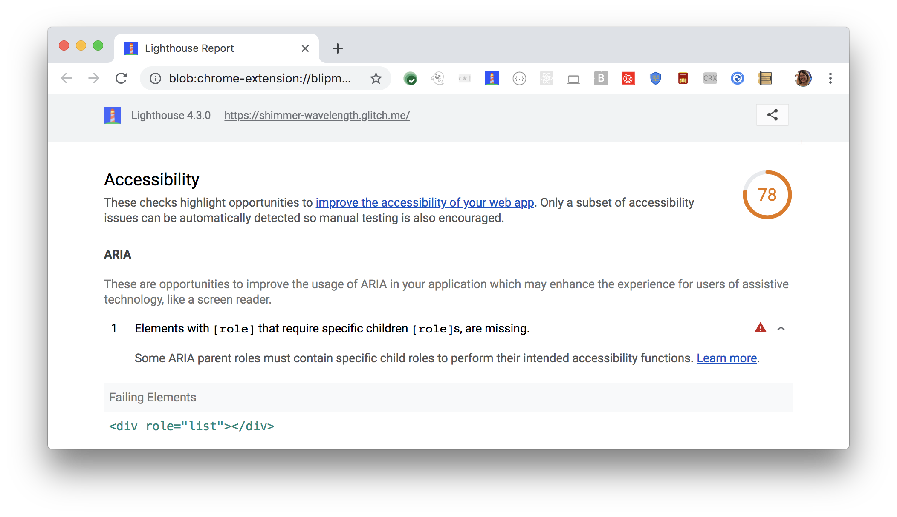

[ARIA](https://www.w3.org/TR/wai-aria-1.1/#role_definitions)
roles and attributes help screen readers
provide missing information about an element.
For these roles and attributes to make sense,
each ARIA `role` supports a specific subset of `aria-*` attributes
(see [ARIA roles definitions](https://www.w3.org/TR/wai-aria-1.1/#role_definitions)).
Some ARIA `roles` require child roles.
Lighthouse reports when a role is missing their required child role(s):

<figure class="w-figure">
  
  <figcaption class="w-figcaption">
    ARIA role missing required child role(s).
  </figcaption>
</figure>



## How Lighthouse finds missing child roles

Lighthouse uses the
[WAI ARIA specification: Definition of Roles](https://www.w3.org/TR/wai-aria-1.1/#role_definitions)
to check for required child roles.
Any role that contains "required owned elements",
is considered a parent role to the child role/s.

Lighthouse fails this audit,
when it finds a parent role that's missing its child role/s.
In the example Lighthouse audit above,
the `list` role requires a group of child elements with `listitem` roles.
Since there are no children with a `listitem` role defined,
the audit fails.
This makes sense,
as it would be confusing to have a list without any list items.

## How this audit impacts overall Lighthouse score

Lighthouse flags this as a medium severity issue. It is important to fix,
and may break the experience for users. In the example above, the element may
still be announced as a list, but the number of items within the list may be
unclear.

## How to check for required child roles

To check for required child roles
refer to the [WAI ARIA Definition of Roles](https://www.w3.org/TR/wai-aria-1.1/#role_definitions).
ARIA explicitly defines required child roles for parent roles.
Link to the parent role from the specification,
and check the required child roles.
Make sure to include a child role for that parent role.

For more information on this audit,
see [Elements must only use allowed ARIA attributes](https://dequeuniversity.com/rules/axe/3.2/aria-required-children).

## More information

- [Ensure parent role includes required children audit source](https://github.com/GoogleChrome/lighthouse/blob/master/lighthouse-core/audits/accessibility/aria-required-children.js)
- [axe-core rule descriptions](https://github.com/dequelabs/axe-core/blob/develop/doc/rule-descriptions.md)
- [List of axe 3.2 rules](https://dequeuniversity.com/rules/axe/3.2)
