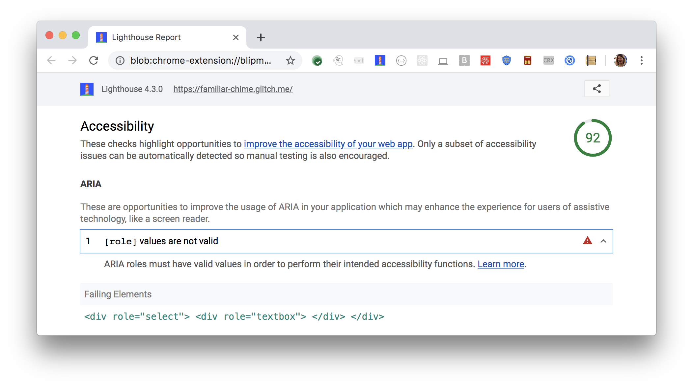

[ARIA](https://www.w3.org/TR/wai-aria-1.1/#role_definitions)
roles and attributes help screen readers
provide missing information about an element.
For these roles and attributes to make sense,
each ARIA `role` supports a specific subset of `aria-*` attributes
(see [ARIA roles definitions](https://www.w3.org/TR/wai-aria-1.1/#role_definitions)).
Some ARIA child roles must be contained by specific parent roles
to properly perform their intended accessibility functions.
Lighthouse reports missing parenrts for these child roles:

<figure class="w-figure">
  
  <figcaption class="w-figcaption">
    Fig. 1 — ARIA role missing required parent role
  </figcaption>
</figure>



## How Lighthouse finds missing parent roles

Lighthouse uses the
[WAI ARIA specification - Definition of roles](https://www.w3.org/TR/wai-aria-1.1/#role_definitions)
to check for required parent roles.
Any role that contains "required context role",
is considered a child role to the parent(s).

Lighthouse fails this audit,
when it finds a child role that's missing its parent.
In the example Lighthouse audit above,
the `listitem` role requires a parent `group` or `list`.
Since there's no parent role defined,
the audit fails.
This makes sense,
as it would be confusing to have a listitem without grouping into a list.

## How this audit impacts overall Lighthouse score

Lighthouse flags this as a low severity issue. It is important to fix, and
probably indicates a mistaken assumption in your code. In the example above, the
element would be announced as plain text content and its `listitem` role would
be discarded.

## How to check for required parent roles

To check for required parent roles
refer to the [WAI ARIA Definition of roles](https://www.w3.org/TR/wai-aria-1.1/#role_definitions).
ARIA explicitly defines required parent roles.
Link to the child role from the specification,
and check the "required context role".
Make sure to include a parent role for that child role.

For more information on this audit,
see [Certain ARIA roles must be contained by particular parent elements](https://dequeuniversity.com/rules/axe/3.2/aria-required-parent).

## More information

- [ARIA child roles are contained within parent roles  audit source](https://github.com/GoogleChrome/lighthouse/blob/master/lighthouse-core/audits/accessibility/aria-required-parent.js)
- [axe-core rule descriptions](https://github.com/dequelabs/axe-core/blob/develop/doc/rule-descriptions.md)
- [List of axe 3.2 rules](https://dequeuniversity.com/rules/axe/3.2)