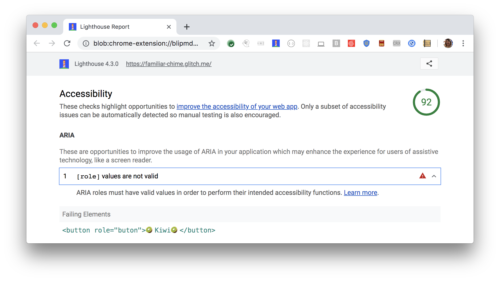

[ARIA](https://www.w3.org/TR/wai-aria-1.1/#role_definitions)
roles and attributes help screen readers
provide missing information about an element.
For these roles and attributes to make sense,
each ARIA `role` supports a specific subset of `aria-*` attributes
(see [ARIA roles definitions](https://www.w3.org/TR/wai-aria-1.1/#role_definitions)).
ARIA roles must have valid values in order
to perform their intended accessibility functions.
Lighthouse reports when a role has invalid values:

<figure class="w-figure">
  
  <figcaption class="w-figcaption">
    ARIA role has invalid values.
  </figcaption>
</figure>



## How Lighthouse determines role has invalid values

Lighthouse uses the
[WAI ARIA specification - Definition of roles](https://www.w3.org/TR/wai-aria-1.1/#role_definitions)
to check a role's values.
Lighthouse fails this audit,
when it finds a role with invalid values.
In the example Lighthouse audit above,
`buton` isn't a valid role value.
Looks like a spelling mistake.

## How this audit impacts overall Lighthouse score

Lighthouse flags this as a low severity issue. It is important to fix, and
probably indicates a mistaken assumption in your code—or a spelling mistake. In
the example above, the element's role should be corrected from `buton` to
`button`.

## How to check for invalid values

To check for invalid values,
refer to the [WAI ARIA Definition of roles](https://www.w3.org/TR/wai-aria-1.1/#role_definitions).
ARIA explicitly defines role values.
If you set `role=` to any value not appearing in the defintions list,
the audit fails.

For more information on this audit,
see [ARIA roles used must conform to valid values](https://dequeuniversity.com/rules/axe/3.1/aria-roles?application=lighthouse).

## More information

- [ARIA role values are vailid audit source](https://github.com/GoogleChrome/lighthouse/blob/master/lighthouse-core/audits/accessibility/aria-roles.js)
- [axe-core rule descriptions](https://github.com/dequelabs/axe-core/blob/develop/doc/rule-descriptions.md)
- [List of axe 3.2 rules](https://dequeuniversity.com/rules/axe/3.2)
