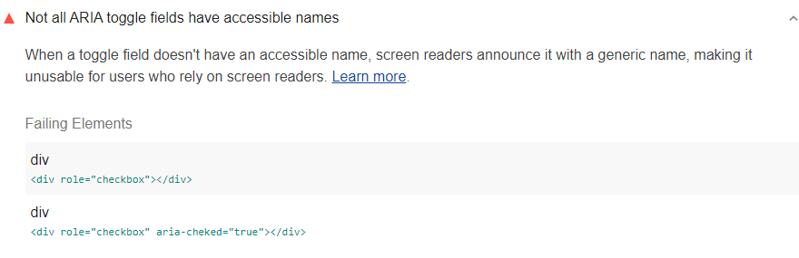





## How Lighthouse identifies ARIA toggle fields without accessible names

[Lighthouse](https://developers.google.com/web/tools/lighthouse/)
flags custom ARIA toggle fields whose names
aren't accessible to assistive technologies:

<figure class="w-figure">
  
</figure>

Elements that have any of the following ARIA roles
but don't have accessible names will cause this audit to fail:
- <a href="https://www.w3.org/TR/wai-aria-practices-1.1/#checkbox" rel="noopener">checkbox</a>
- <a href="https://www.w3.org/TR/wai-aria-1.1/#menuitemcheckbox" rel="noopener">menuitemcheckbox</a>
- <a href="https://www.w3.org/TR/wai-aria-1.1/#menuitemradio" rel="noopener">menuitemradio</a>
- <a href="https://www.w3.org/TR/wai-aria-1.1/#radio" rel="noopener">radio</a>
- <a href="https://www.w3.org/TR/wai-aria-1.1/#switch" rel="noopener">switch</a>

This audit is similar to the
[**Not all ARIA input fields have accessible names** audit](/aria-input-field-name)
but checks a different set of ARIA roles.





## How to add accessible names to your custom ARIA toggle fields

### Option 1: Add inner text to the element

The easiest way to provide an accessible name for most elements
is to include text content inside the element.

For example, this custom checkbox will be announced as "Newspaper"
to assistive technology users:

```html
<div id="checkbox1" role="checkbox">Newspaper</div>
```

### Option 2: Add an `aria-label` attribute to the element
If you can't add inner text—for example, if you don't want
the element's name to be visible—use
the `aria-label` attribute.

This custom switch will be announced as "Toggle blue light"
to assistive technology users:

```html
<div id="switch1"
    role="switch"
    aria-checked="true"
    aria-label="Toggle blue light">
    <span>off</span>
    <span>on</span>
</div>
```

### Option 3: Refer to another element using `aria-labelledby`

Use the `aria-labelledby` attribute to identify another element, using its ID,
to serve as the name for the current element.

For example, this custom menu radio button refers to the `menuitem1Label` paragraph
as its label and will be announced as "Sans-serif":

```html
<p id="menuitem1Label">Sans-serif</p>
<ul role="menu">
    <li id="menuitem1"
        role="menuitemradio"
        aria-labelledby="menuitem1Label"
        aria-checked="true"></li>
</ul>
```

## Resources
- <a href="https://github.com/GoogleChrome/lighthouse/blob/master/lighthouse-core/audits/accessibility/aria-toggle-field-name.js" rel="noopener">Source code for **Not all ARIA toggle fields have accessible names** audit</a>
- <a href="https://dequeuniversity.com/rules/axe/3.3/aria-toggle-field-label" rel="noopener">ARIA toggle fields have an accessible name (Deque University)</a>
- [Labels and text alternatives](/labels-and-text-alternatives)
- [Use semantic HTML for easy keyboard wins](/use-semantic-html)
