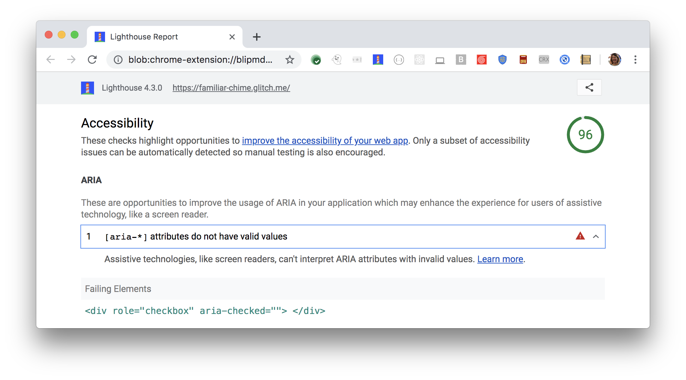

[ARIA](https://www.w3.org/TR/wai-aria-1.1/#role_definitions)
roles and attributes help screen readers
provide missing information about an element.
For these roles and attributes to make sense,
each ARIA `role` supports a specific subset of `aria-*` attributes
(see [ARIA roles definitions](https://www.w3.org/TR/wai-aria-1.1/#role_definitions)).
Assistive technologies, like screen readers,
can't interpret ARIA attributes with invalid values.



## How Lighthouse determines an attribute's value is invalid

Lighthouse flags ARIA attributes with invalid values:

<figure class="w-figure">
  
</figure>

Lighthouse uses the
[WAI ARIA specification: Definition of Roles](https://www.w3.org/TR/wai-aria-1.1/#role_definitions)
to check the values of roles and their attrbutes.
Lighthouse fails this audit,
when it finds attributes with invalid values.
In the example Lighthouse audit above,
`aria-checked` should be set to either `true`, `false`, or `mixed`.


HTML Boolean attributes such as `hidden` or `checked` are assumed to be either
true or false depending on if they are present on the element.

However, ARIA attributes require an _explicit_ `true` or `false` string.
This is because most ARIA attributes actually support [a third state](https://www.w3.org/TR/wai-aria-1.1/#valuetype_true-false-undefined)—`undefined`—or a [tristate](https://www.w3.org/TR/wai-aria-1.1/#valuetype_tristate)
with an intermediate `mixed` value.


This issue is important to fix and
probably indicates a mistaken assumption in your code. In the example above, the
element is still announced as a checkbox but it will have an implicit
checked state of `unchecked`.



## How to check for invalid attribute values

Refer to the [WAI ARIA Definition of Roles](https://www.w3.org/TR/wai-aria-1.1/#role_definitions).
ARIA defines a role's allowable attributes, and the valid values for those attributes.
Check that you are using the correct values for any attributes you use in your roles.

For more information on this audit,
see [ARIA attributes must conform to valid values](https://dequeuniversity.com/rules/axe/3.3/aria-valid-attr-value).

## Resources

- [Source code for **`[aria-*]` attributes do not have valid values** audit](https://github.com/GoogleChrome/lighthouse/blob/master/lighthouse-core/audits/accessibility/aria-valid-attr-value.js)
- [ARIA attributes must conform to valid values](https://dequeuniversity.com/rules/axe/3.3/aria-valid-attr-value)
