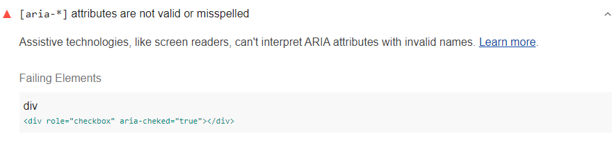

[ARIA](https://www.w3.org/TR/wai-aria-1.1/#role_definitions)
roles and attributes help screen readers
provide missing information about an element.
For these roles and attributes to make sense,
each ARIA `role` supports a specific subset of `aria-*` attributes
(see [ARIA roles definitions](https://www.w3.org/TR/wai-aria-1.1/#role_definitions)).
Assistive technologies, like screen readers,
can't interpret ARIA attributes with invalid names.
Lighthouse reports ARIA attributes with invalid values:

<figure class="w-figure">
  
  <figcaption class="w-figcaption">
    ARIA attribute has invalid value.
  </figcaption>
</figure>



## How Lighthouse checks for invalid attribute values

Lighthouse uses the
[WAI ARIA specification: Definition of Roles](https://www.w3.org/TR/wai-aria-1.1/#role_definitions)
to check accepted values for roles and attributes.

Lighthouse fails this audit,
when it finds an attribute with an invalid value.
In the example Lighthouse audit above,
the `aria-checked` attribute is undefined,
when it should be either `true` or `false`.
The audit fails since the attribute has an invalid value.

<!--
## How this audit impacts overall Lighthouse score

Todo. I have no idea how accessibility scoring is working!
-->
## How to check attribute values are valid

To check attribute values
refer to the [WAI ARIA Definition of Roles](https://www.w3.org/TR/wai-aria-1.1/#role_definitions).
Check the role definition that the attribute describes,
and then check the values for that attribute.

For more information on this audit,
see [ARIA attributes must conform to valid values](https://dequeuniversity.com/rules/axe/3.3/aria-valid-attr-value).

## More information

- [ARIA attributes are valid audit source](https://github.com/GoogleChrome/lighthouse/blob/master/lighthouse-core/audits/accessibility/aria-valid-attr.js)
- [axe-core rule descriptions](https://github.com/dequelabs/axe-core/blob/develop/doc/rule-descriptions.md)
