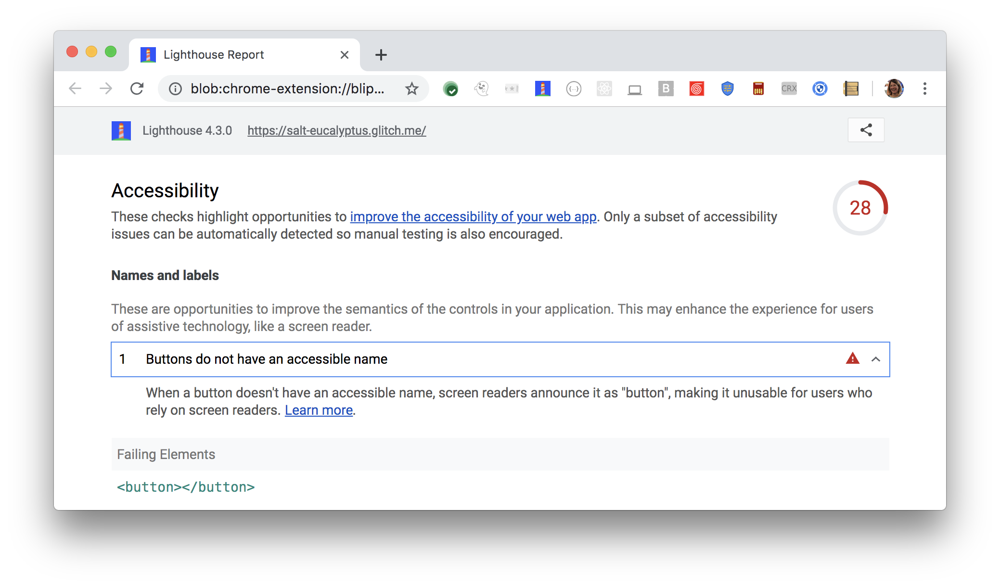

When a button doesn't have an accessible name,
screen readers announce it as "button",
making it unusable for users who rely on screen readers.
Lighthouse reports when any buttons do not have accessible names:

<figure class="w-figure">
  
  <figcaption class="w-figcaption">
    Buttons do not have an accessible name.
  </figcaption>
</figure>


## How to fix this problem

To fix this problem,
provide inner text for each `button` element
that is discernible to screen reader users
(see also [Label buttons and links](/labels-and-text-alternatives#label-buttons-and-links)).
For example,
create clear calls to action:

```html
<button>Book Room</button>
```

When working with icon buttons,
use the `aria-label` attribute to clearly describe the action
to anyone using a screen reader, for example:

```html
<button aria-label="Bold text icon"></button>
```

Learn more in
[Buttons must have discernible text](https://dequeuniversity.com/rules/axe/3.2/button-name).

<!--
## How this audit impacts overall Lighthouse score

Todo. I have no idea how accessibility scoring is working!
-->
## More information

- [Ensure buttons have accessible name audit source](https://github.com/GoogleChrome/lighthouse/blob/master/lighthouse-core/audits/accessibility/button-name.js)
- [axe-core rule descriptions](https://github.com/dequelabs/axe-core/blob/develop/doc/rule-descriptions.md)
- [List of axe 3.2 rules](https://dequeuniversity.com/rules/axe/3.2)
