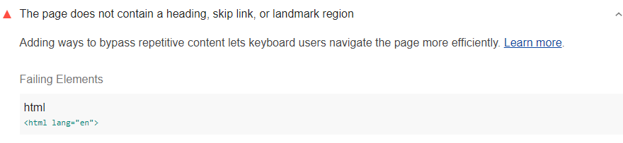

Adding ways to bypass repetitive content lets keyboard users navigate the page more efficiently.
Lighthouse reports when the page doesn't contain a heading, skip link, or landmark region:

<figure class="w-figure">
  
  <figcaption class="w-figcaption">
    Fig. 1 — The page doesn't contain a heading, skip link, or landmark region
  </figcaption>
</figure>


## How to fix this problem

It's simple to pass the Lighthouse audit:
include either an internal skip link, a heading, or a landmark region.

But to truly fix the problem,
use correct heading and landmark elements on the entire page.
By doing this,
you are greatly improving the navigation experience
for users of assistive technology.
See [Headings and landmarks](/headings-and-landmarks).

In this example,
all content is inside of a landmark,
headings outline the page,
no headings are skipped,
and repetitive content is bypassed:

```html
<!DOCTYPE html>
<html lang="en">
  <head>
    <title>Document title</title>
    <meta charset="utf-8">
    <meta http-equiv="X-UA-Compatible" content="IE=edge">
    <meta name="viewport" content="width=device-width, initial-scale=1">
    <link rel="stylesheet" href="/style.css">
  </head>  
  <body>
    <a class="skip-link" href="#maincontent">Skip to main</a>
    <h1>Page title</h1>
    <nav>
      <ul>
        <li>
          <a href="https://google.com">Nav link</a>
          <a href="https://google.com">Nav link</a>
          <a href="https://google.com">Nav link</a>
        </li>
      </ul>
    </nav>
    <main id="maincontent">
      <section>
        <h2>Section heading</h2>
	      <p>
	        Bacon ipsum dolor amet brisket meatball chicken, cow hamburger pork belly
	        alcatra pig chuck pork loin jerky beef tri-tip porchetta shank. Kevin porchetta
	        landjaeger, ribeye bacon strip steak pork chop tenderloin andouille.
	      </p>
        <h3>Sub-section heading</h3>
          <p>
            Prosciutto pork chicken chuck turkey tongue landjaeger shoulder picanha capicola
            ball tip meatball strip steak venison salami. Shoulder frankfurter short ribs
            ham hock, ball tip pork chop tenderloin beef ribs pastrami filet mignon.
          </p>
      </section>
    </main>
  </body>
</html>
```

```css
/* style.css */
.skip-link {
  position: absolute;
  top: -40px;
  left: 0;
  background: #000000;
  color: white;
  padding: 8px;
  z-index: 100;
}

.skip-link:focus {
  top: 0;
}
```

Learn more in
[Page must have means to bypass repeated blocks](https://dequeuniversity.com/rules/axe/3.2/bypass).

<!--
## How this audit impacts overall Lighthouse score

Todo. I have no idea how accessibility scoring is working!
-->
## More information

- [Use headings, landmarks, and skip-link audit source](https://github.com/GoogleChrome/lighthouse/blob/master/lighthouse-core/audits/accessibility/bypass.js)
- [axe-core rule descriptions](https://github.com/dequelabs/axe-core/blob/develop/doc/rule-descriptions.md)
- [List of axe 3.2 rules](https://dequeuniversity.com/rules/axe/3.2)