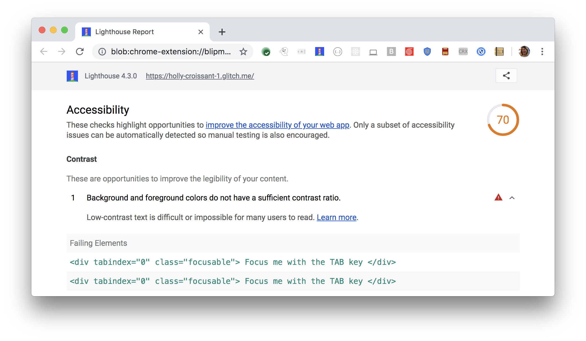

Low-contrast text is difficult or impossible for many users to read.
Lighthouse reports when the background and
foreground colors do not have a sufficient contrast ratio:

<figure class="w-figure">
  
  <figcaption class="w-figcaption">
    The background and foreground colors do not have sufficient contrast ration.
</figure>

## How to fix this problem

To fix this problem,
provide sufficient contrast for background and foreground colors.
Some people with low vision experience low contrast.
Everything tends to appear about the same brightness,
which makes it hard to distinguish outlines, borders, edges, and details.

Text that is too close in luminance (brightness) to the background can be hard to read,
especially for people with low vision,
but all users can benefit from sufficient contrast.
Ensure color contrast of at least 4.5:1 for small text or 3:1 for large text.
Large text is defined as 18pt or 14pt bold.

Try the Color Contrast Analyser in
[Text elements must have sufficient color contrast against the background](https://dequeuniversity.com/rules/axe/3.3/color-contrast).

<!--
## How this audit impacts overall Lighthouse score

Todo. I have no idea how accessibility scoring is working!
-->
## More information

- [Ensure background and foreground colors have sufficient contrast ratio audit source](https://github.com/GoogleChrome/lighthouse/blob/master/lighthouse-core/audits/accessibility/color-contrast.js)
- [axe-core rule descriptions](https://github.com/dequelabs/axe-core/blob/develop/doc/rule-descriptions.md)
