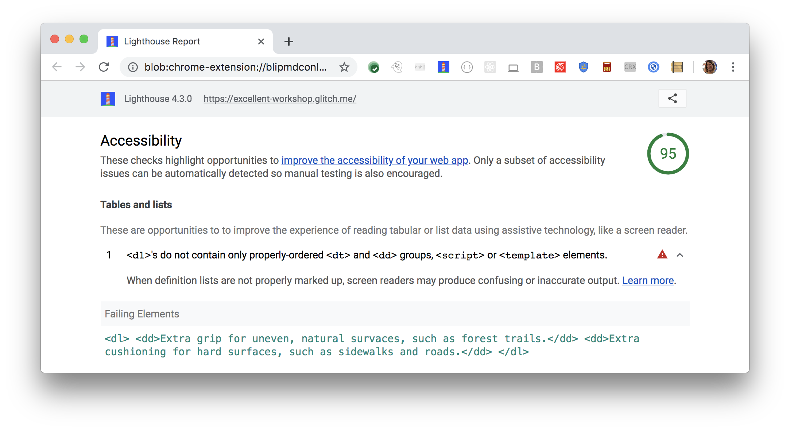

When definition lists are not properly marked up,
screen readers may produce confusing or inaccurate output.
Lighthouse reports when `<dl>` elements do not contain properly-ordered `<dt>` and `<dd>` groups,
`<script>`, or `<template>` elements:

<figure class="w-figure">
   and <dd> groups, <script>, or <template> elements">
  <figcaption class="w-figcaption">
    Defintion lists do not contain properly ordered <code>&lt;dt></code> and <code>&lt;dd></code> groups,
    <code>&lt;script></code>, or <code>&lt;template></code> elements.
  </figcaption>
</figure>

## How to fix this problem

To fix this problem,
structure your defintion list elements correctly.
Screen readers have a specific way of announcing definition lists.
When definition lists are not properly marked up,
this creates the opportunity for confusing or inaccurate screen reader output.

Definition list items require `dl` elements around the list,
`dt` elements for each term, and `dd` elements for each definition.
Each set of `dt` elements must be followed by one or more `dd` elements.
For example:

```html
<dl>
  <dt>Trail shoe</dt>
    <dd>Extra grip for uneven, natural survaces, such as forest trails.</dd>
  <dt>Road shoe</dt>
    <dd>Extra cushioning for hard surfaces, such as sidewalks and roads.</dd>
</dl>
```

Learn more in
[`<dl>` elements must only directly contain properly-ordered `<dt>` and `<dd>` groups, `<script>`, or `<template>` elements](https://dequeuniversity.com/rules/axe/3.3/definition-list).

<!--
## How this audit impacts overall Lighthouse score

Todo. I have no idea how accessibility scoring is working!
-->
## More information

- [Ensure defintion list are structured correctly audit source](https://github.com/GoogleChrome/lighthouse/blob/master/lighthouse-core/audits/accessibility/definition-list.js)
- [axe-core rule descriptions](https://github.com/dequelabs/axe-core/blob/develop/doc/rule-descriptions.md)
