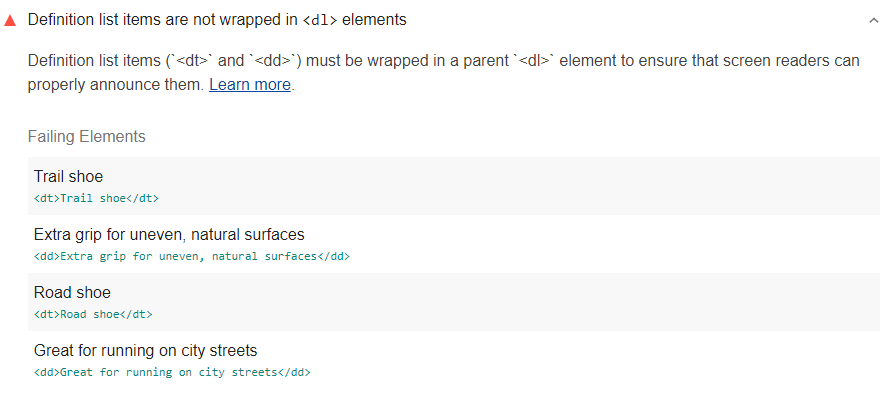

Definition list items (`<dt>` and `<dd>`) must be wrapped in a parent `<dl>` element
to ensure that screen readers can properly announce them.
Lighthouse reports when definition list items are not wrapped in `<dl>` elements:

<figure class="w-figure">
   elements">
  <figcaption class="w-figcaption">
    Defintion list items are not wrapped in <code>&lt;dl></code> elements.
  </figcaption>
</figure>

## How to fix this problem

To fix this problem,
wrap the definition list items in parent `dl` elements to ensure the list follows the proper hierarchy.

Definition list items require `dl` elements around the list,
`dt` elements for each term, and `dd` elements for each definition.
Each set of `dt` elements must be followed by one or more `dd` elements.
For example:

```html
<dl>
  <dt>Trail shoe</dt>
    <dd>Extra grip for uneven, natural survaces, such as forest trails.</dd>
  <dt>Road shoe</dt>
    <dd>Extra cushioning for hard surfaces, such as sidewalks and roads.</dd>
</dl>
```

Learn more in
[`<dt>` and `<dd>` elements must be contained by a `<dl>`](https://dequeuniversity.com/rules/axe/3.1/dlitem?application=lighthouse).

<!--
## How this audit impacts overall Lighthouse score

Todo. I have no idea how accessibility scoring is working!
-->
## More information

- [Ensure defintion list items are wrapped in parent `<dl>` element audit source](https://github.com/GoogleChrome/lighthouse/blob/master/lighthouse-core/audits/accessibility/dlitem.js)
- [axe-core rule descriptions](https://github.com/dequelabs/axe-core/blob/develop/doc/rule-descriptions.md)
