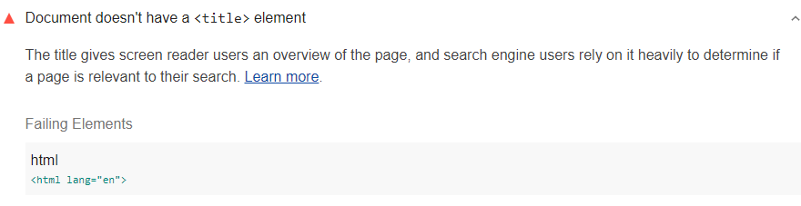

Every page should have a title element that briefly explains what the page is about.
The title element gives screen reader users an overview of the page.
Search engine users also rely on it heavily to determine
if a page is relevant to their search.
Lighthouse reports when the HTML document doesn't have a title:

<figure class="w-figure">
  
  <figcaption class="w-figcaption">
    HTML document doesn't have a title element.
  </figcaption>
</figure>


## How to fix this problem

To fix this problem,
provide a title for your page.
When a screen reader enters the page,
the title is the first text that is announced.
Make sure your page has a title,
and that title provides context about the page:

```html
<!doctype html>
  <html lang="en">
    <head>
      <title>20-week training schedule for your first marathon</title>
    </head>
  <body>
    …
  </body>
</html>
```

Learn more in
[Write descriptive titles, descriptions, and link text for every page](/write-descriptive-text)
and [Documents must contain a title element to aid in navigation](https://dequeuniversity.com/rules/axe/3.3/document-title).


## Tips for creating great titles

- Make them descriptive and concise. Avoid vague descriptions like Home.
- Avoid keyword stuffing.
- It's not helpful to users, and search engines may mark the page as spam.
- Avoid repeated or boilerplate titles.
- It's OK to brand your titles, but do it concisely.

See [Create descriptive page titles](https://support.google.com/webmasters/answer/35624)
for more on these tips.

<!--
## How this audit impacts overall Lighthouse score

Todo. I have no idea how accessibility scoring is working!
-->
## More information

- [Label documents and frames](/labels-and-text-alternatives#label-documents-and-frames)
- [Ensure HTML document has a title audit source](https://github.com/GoogleChrome/lighthouse/blob/master/lighthouse-core/audits/accessibility/document-title.js)
- [axe-core rule descriptions](https://github.com/dequelabs/axe-core/blob/develop/doc/rule-descriptions.md)
