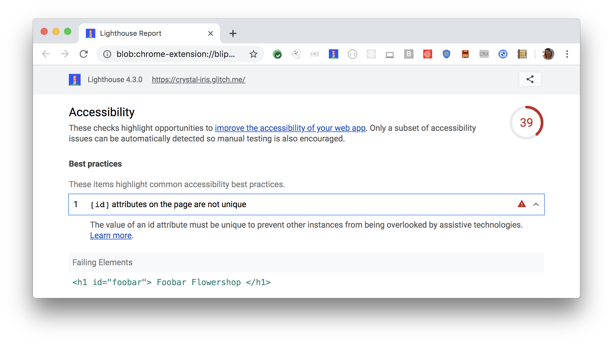

The value of an id attribute must be unique to prevent other instances
from being overlooked by assistive technologies.
Lighthouse reports any duplicate IDs found in a page:

<figure class="w-figure">
  
  <figcaption class="w-figcaption">
    Fig. 1 — ID attributes on the pgae are not unique
  </figcaption>
</figure>

## How to fix this problem

To fix this problem,
avoid duplicate IDs.
Duplicate IDs are common validation errors that may break the accessibility of labels.
Assistive technologies typically only reference the first one accurately.

To remove duplicate IDs,
change an ID value if it is used more than once to be sure each is unique.
Learn more in
[ID attribute values must be unique](https://dequeuniversity.com/rules/axe/3.2/duplicate-id).

<!--
## How this audit impacts overall Lighthouse score

Todo. I have no idea how accessibility scoring is working!
-->
## More information

- [ID attributes on a page are unique audit source](https://github.com/GoogleChrome/lighthouse/blob/master/lighthouse-core/audits/accessibility/duplicate-id.js)
- [axe-core rule descriptions](https://github.com/dequelabs/axe-core/blob/develop/doc/rule-descriptions.md)
- [List of axe 3.2 rules](https://dequeuniversity.com/rules/axe/3.2)