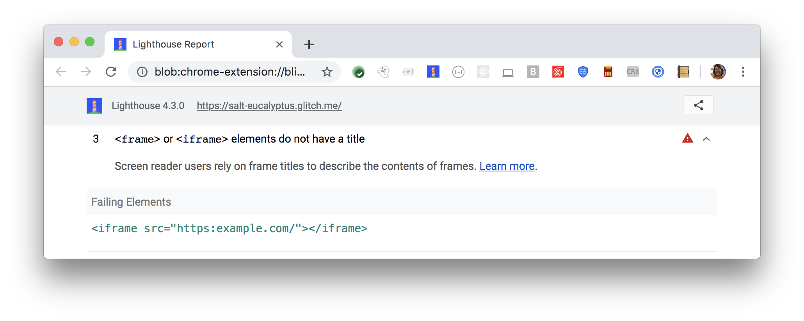

Screen reader users rely on frame titles to describe the contents of frames.
Lighthouse reports when any`<frame>` or `<iframe>` elements do not have a title:

<figure class="w-figure">
  
  <figcaption class="w-figcaption">
    Frame or IFrame doesn't have a title element.
  </figcaption>
</figure>


## How to fix this problem

To fix this problem,
provide unique and descriptive `title` attributes for all `frame` and `iframe` elements.
Screen reader users rely on a frame title to describe the contents of the frame.
Navigating through frames and IFrames can quickly become difficult and confusing
for users of this technology if the frames are not marked with a title attribute.

Additionally, best practice is to give the enclosed document a title element
with content identical to the title attribute.
For example:

```html
<iframe title="My Daily Marathon Tracker" src="https://www.mydailymarathontracker.com/"></iframe>
```

Learn more in [Frames must have title attribute](https://dequeuniversity.com/rules/axe/3.2/frame-title).

## Tips for creating descriptive frame titles:

- As previously mentioned, give the enclosed document a title element with content identical to title attribute.
- Replace placeholder titles such as "untitled frame" with a more appropriate phrase.
- Make each title unique. Don't duplicate titles, even if they are similar.

Learn more in
[Write descriptive titles, descriptions, and link text for every page](/write-descriptive-text).

<!--
## How this audit impacts overall Lighthouse score

Todo. I have no idea how accessibility scoring is working!
-->
## More information

- [Label documents and frames](/labels-and-text-alternatives#label-documents-and-frames)
- [Ensure frames have titles audit source](https://github.com/GoogleChrome/lighthouse/blob/master/lighthouse-core/audits/accessibility/frame-title.js)
- [axe-core rule descriptions](https://github.com/dequelabs/axe-core/blob/develop/doc/rule-descriptions.md)
- [List of axe 3.2 rules](https://dequeuniversity.com/rules/axe/3.2)
