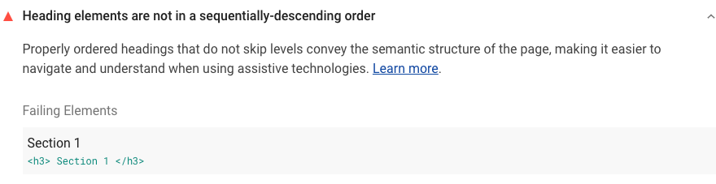

Screen readers users often navigate an unfamiliar page by exploring headings.
By using the correct headings,
you can dramatically improve the navigation experience on your site
for users of assistive technology.

## How the Lighthouse heading levels audit fails

[Lighthouse](https://developers.google.com/web/tools/lighthouse/)
flags pages whose headings skip one or more levels:

<figure class="w-figure">
  
</figure>



## How to fix poorly structured headings

Use headings to create a structural outline for your page.
Create a skeleton or scaffold of the page
that anyone navigating by headings can use to form a mental picture.

Use [this list of landmark elements](https://www.w3.org/TR/2017/NOTE-wai-aria-practices-1.1-20171214/examples/landmarks/HTML5.html) to check your page.
Click the "Show Headings" button to see a structural outline for the page.

Make sure all headings follow a logical, numerical order.
For example:

```html
<h1>Company name</h1>
<section>
  <h2>Section Heading</h2>
  …
  <h3>Sub-section Heading</h3>
</section>
```

Don't skip heading levels.
For example, look out for an `<h1>` heading followed by an `<h3>` heading.
It's an anti-pattern to skip heading levels to use the browser's default heading styles.
Fix any skipped heading levels and use your own CSS for styling.

See the [Headings and landmarks](/headings-and-landmarks)
post for more information.

## Resources

- <a href="https://github.com/GoogleChrome/lighthouse/blob/master/lighthouse-core/audits/accessibility/heading-order.js" rel="noopener">Source code for **Heading elements are not in a sequentially descending order** audit</a>
- <a href="https://dequeuniversity.com/rules/axe/3.3/heading-order" rel="noopener">Heading levels should only increase by one</a>
