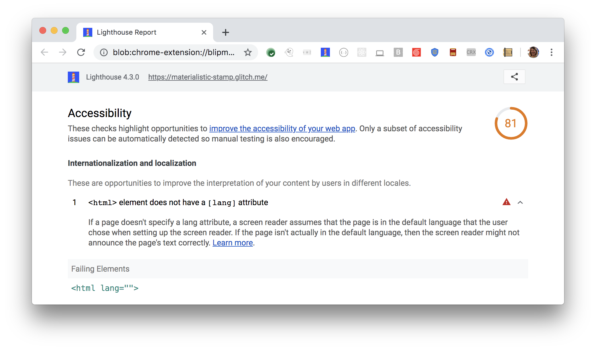

If a page doesn't specify a lang attribute,
a screen reader assumes the page is in the default language
that the user chose when setting up their screen reader.
Lighthouse reports when the `<html>` element does not have a `lang` attribute':

<figure class="w-figure">
   element does not have a lang attribute">
  <figcaption class="w-figcaption">
    The <code>&lt;html></code> element does not have a <code>lang</code> attribute.
</figure>


## How to fix this problem

To fix this problem,
add a `lang` attribute to the `<html>` element:

```html
<html lang="en">
```

Screen readers use different sound libraries for each language.
Screen readers can switch between these language libraries easily,
but only if the documents specify which language(s) to read and when.
If the language is not specified,
it is impossible to understand anything
when screen readers are using the wrong language library.

Learn more in [`<html>` element must have a lang attribute](https://dequeuniversity.com/rules/axe/3.3/html-has-lang).

<!--
## How this audit impacts overall Lighthouse score

Todo. I have no idea how accessibility scoring is working!
-->
## More information

- [Ensure every HTML document has a `lang` attribute](https://github.com/GoogleChrome/lighthouse/blob/master/lighthouse-core/audits/accessibility/html-has-lang.js)
- [axe-core rule descriptions](https://github.com/dequelabs/axe-core/blob/develop/doc/rule-descriptions.md)
