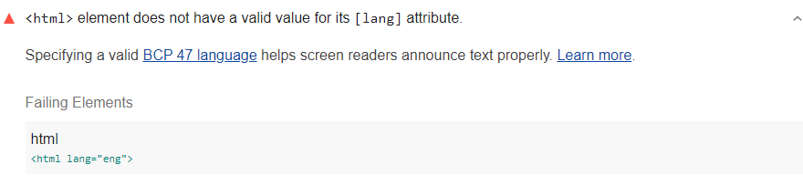

Specifying a valid
[BCP 47 language](https://www.w3.org/International/questions/qa-choosing-language-tags#question)
helps screen readers announce text properly.
Lighthouse reports when the `<html>` element does not have a valid value
for its `lang` attribute.

<!--
***Todo*** I can't seem to get this audit to fail. Need to talk to Rob about this one.
Basically it seems to default to html-has-lang failure,
without any different in terms of validity.

<figure class="w-figure">
   element does not have a valid value for its lang attribute">
  <figcaption class="w-figcaption">
    Fig. 1 — The <code>&lt;html></code> element does not have a valid value for its <code>lang</code> attribute
</figure>
-->
## How to fix this problem

To fix this problem,
use valid language codes in `lang` attributes.
The language specified in the HTML document must be one of the valid languages
to ensure text is pronounced correctly for screen reader users.
For example, this sets the language of the document to English:

```html
<html lang="en">
```

Learn more in [lang attribute must have a valid value](https://dequeuniversity.com/rules/axe/3.2/valid-lang).

<!--
## How this audit impacts overall Lighthouse score

Todo. I have no idea how accessibility scoring is working!
-->
## More information

- [Ensure `lang` attribute of `<html>` element has valid value audit source](https://github.com/GoogleChrome/lighthouse/blob/master/lighthouse-core/audits/accessibility/html-lang-valid.js)
- [axe-core rule descriptions](https://github.com/dequelabs/axe-core/blob/develop/doc/rule-descriptions.md)
- [List of axe 3.2 rules](https://dequeuniversity.com/rules/axe/3.2)