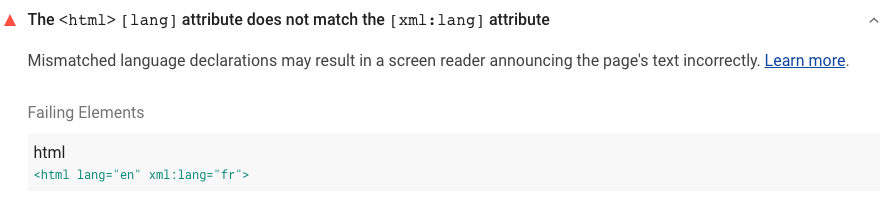

If you need to migrate your HTML document to or from XML,
you may need to specify an `xml:lang` attribute on your `<html>` element
to ensure that screen readers and other assistive technologies
read your content correctly in all the environments in which the document appears.

The [HTML spec](https://html.spec.whatwg.org/multipage/dom.html#the-lang-and-xml:lang-attributes)
requires that any `<html>` element with an `xml:lang` attribute must _also_ have
a `lang` attribute.
If the values of these two attributes don't match,
assistive technologies will use the `xml:lang` value,
which may lead to incorrect pronunciation of your content.

## How the Lighthouse `lang`-`xml:lang` mismatch audit fails

[Lighthouse](https://developers.google.com/web/tools/lighthouse/)
flags `<html>` elements whose `lang` and `xml:lang` attribute values don't match:

<figure class="w-figure">
  
</figure>



## How to fix `lang` and `xml:lang` mismatches

Change the value of either the `lang` attribute or the `xml:lang` attribute
to match the intended language for your page.
Be sure to use a valid
[BCP 47 language](https://www.w3.org/International/questions/qa-choosing-language-tags#question).


Unless you're migrating your HTML document to or from XML,
it's best to simply remove the `xml:lang` attribute and
use the `lang` attribute alone.


## Resources
- <a href="https://github.com/GoogleChrome/lighthouse/blob/master/lighthouse-core/audits/accessibility/html-xml-lang-mismatch.js" rel="noopener">Source code for **The `<html>` `[lang]` attribute does not match the `[xml:lang]` attribute** audit</a>
- <a href="https://dequeuniversity.com/rules/axe/3.3/html-xml-lang-mismatch" rel="noopener">&#60;html&#62; elements with lang and xml:lang must have the same base language</a>
- <a href="https://html.spec.whatwg.org/multipage/dom.html#the-lang-and-xml:lang-attributes" rel="noopener">The `lang` and `xml:lang` attributes (HTML specification)</a>
