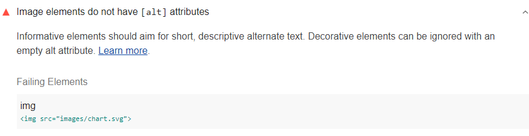

Informative elements should aim for short, descriptive alternate text.
Decorative elements can be ignored with an empty alt attribute.
Lighthouse reports when any `` elements do not have `alt` attributes:

<figure class="w-figure">
   elements do not have alt attributes">
  <figcaption class="w-figcaption">
    <code>&lt;img></code> elements do not have <code>alt</code> attributes.
  </figcaption>
</figure>


## How to fix this problem

To fix this problem,
provide `alt` attributes for every `` element.
If the image fails to load,
the `alt` text is used as a placeholder
so users have a sense of what the image was trying to convey
(see also
[Include text alternatives for images and objects](/labels-and-text-alternatives#include-text-alternatives-for-images-and-objects)).

Most images should have short, descriptive text:

```html

```

If the image acts as decoration and does not provide any useful content,
give it an empty `alt=""` attribute to remove it from the accessibility tree:

```html

```

Learn more in [Images must have alternate text](https://dequeuniversity.com/rules/axe/3.2/image-alt?application=lighthouse).


You can also use ARIA labels to describe your images, for example,
``
See also
[Using the aria-label attribute](https://developer.mozilla.org/en-US/docs/Web/Accessibility/ARIA/ARIA_Techniques/Using_the_aria-label_attribute) and
[Using the aria-labelledby attribute
](https://developer.mozilla.org/en-US/docs/Web/Accessibility/ARIA/ARIA_Techniques/Using_the_aria-labelledby_attribute).


## Tips for writing effective `alt` text

- `alt` text should give the intent, purpose, and meaning of the image.
- Blind users should get as much information from alt text as a sighted user gets from the image.
- Avoid non-specific words like "chart", "image", or "diagram".

Learn more in
[WebAIM's guide to Alternative Text](https://webaim.org/techniques/alttext/).

<!--
## How this audit impacts overall Lighthouse score

Todo. I have no idea how accessibility scoring is working!
-->
## More information

- [Ensure images have `alt` text audit source](https://github.com/GoogleChrome/lighthouse/blob/master/lighthouse-core/audits/accessibility/image-alt.js)
- [axe-core rule descriptions](https://github.com/dequelabs/axe-core/blob/develop/doc/rule-descriptions.md)
- [List of axe 3.2 rules](https://dequeuniversity.com/rules/axe/3.2)
