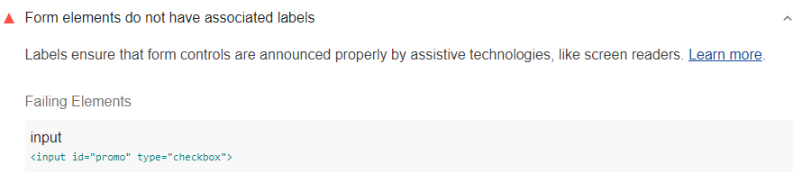

Labels ensure that form controls are announced properly
by assistive technologies, like screen readers.
Lighthouse reports when form elements do not have associated labels:

<figure class="w-figure">
  
  <figcaption class="w-figcaption">
    Form elements do not have associated labels.
  </figcaption>
</figure>


## How to fix this problem

To fix this problem,
provide a label for every form element.
Screen reader users rely on these labels
to navigate forms.
Mouse or touchscreen users also benefit from labels,
as the label text becomes a click target.

There are two ways to associate a label with a form element.
Either place the input element inside a label element:

<!--
***Todo*** I got these example from the accessibility docs;
however, both `<input>` lines of code are throwing errors,
which seem to be due to input end tag.
I'm fairly sure you can't have an input end tag,
but need to confirm with Rob.
-->
```html
<label>
  <input type="checkbox">Receive promotional offers?</input>
</label>
```

Or use the label's `for` attribute and refer to the element's id:

```html
<input id="promo" type="checkbox"></input>
<label for="promo">Receive promotional offers?</label>
```

When the checkbox has been labeled correctly,
the screen reader reports that the element has a role of checkbox,
is in a checked state, and is named "Receive promotional offers?"
See also [Label form elements](/labels-and-text-alternatives#label-form-elements).

<!--
## How this audit impacts overall Lighthouse score

Todo. I have no idea how accessibility scoring is working!

## More information
-->
- [Form `<input>` elements must have labels](https://dequeuniversity.com/rules/axe/3.3/label)
- [Ensure every form element has a label audit source](https://github.com/GoogleChrome/lighthouse/blob/master/lighthouse-core/audits/accessibility/label.js)
- [axe-core rule descriptions](https://github.com/dequelabs/axe-core/blob/develop/doc/rule-descriptions.md)
