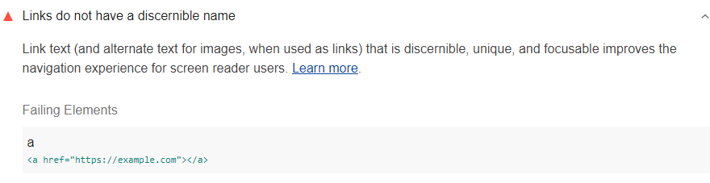

Link text that is discernible, unique, and focusable improves the navigation experience for screen reader users.
Lighthouse reports when links do not have discernible names:

<figure class="w-figure">
  
  <figcaption class="w-figcaption">
    Links do not have discernible names.
  </figcaption>
</figure>


## How to fix this problem

To fix this problem,
provide an accessible name
for every link.
Similar to buttons,
links primarily get their accessible name from their text content.
Avoid filler words like "Here" or "Read more";
instead, put the most meaningful text into the link itself:

```html
Check out <a href="…">our guide to creating accessible web pages</a>.
</html>
```

Learn more in
[Label buttons and links](/labels-and-text-alternatives#label-buttons-and-links).

<!--
## How this audit impacts overall Lighthouse score

Todo. I have no idea how accessibility scoring is working!
-->
## More information

- [Links must have discernible text](https://dequeuniversity.com/rules/axe/3.3/link-name)
- [Ensure links have discernible text audit source](https://github.com/GoogleChrome/lighthouse/blob/master/lighthouse-core/audits/accessibility/link-name.js)
- [axe-core rule descriptions](https://github.com/dequelabs/axe-core/blob/develop/doc/rule-descriptions.md)
