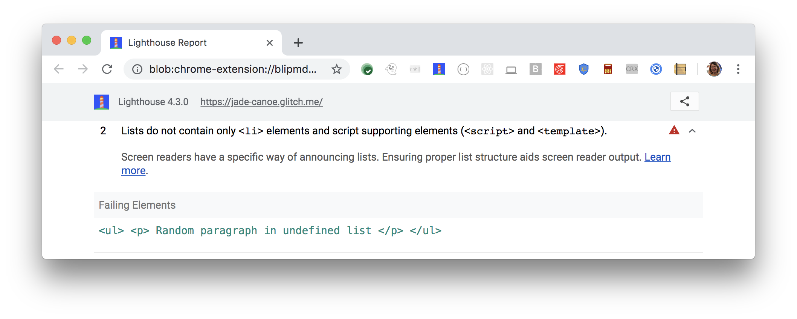

Screen readers depend upon lists being structured properly,
to keep users informed of content within the lists.
The only content lists should contain should be within `<li>` elements.
They can also contain script supporting elements (`<script>` and `<template>`).
Lighthouse reports when lists contain any other content elements that shouldn't be within the lists:

<figure class="w-figure">
  
    Fig. 1 — Lists contain content elements that shouldn't be within the list
  </figcaption>
</figure>

## How to fix this problem

To fix this problem,
remove any elements in lists that don't belong there.
Ordered and unordered lists must only contain `<li>`, `<script>` or `<template>` elements.

Valid lists must have parent elements (`ul` or `ol` elements) and child elements (`li` elements).
Any other content elements are invalid.
Learn more in
[`<ul>` and `<ol>` must only directly contain `<li>`, `<script>` or `<template>` elements](https://dequeuniversity.com/rules/axe/3.2/list).

<!--
## How this audit impacts overall Lighthouse score

Todo. I have no idea how accessibility scoring is working!
-->
## More information

- [Ensure lists are structured correctly audit source](https://github.com/GoogleChrome/lighthouse/blob/master/lighthouse-core/audits/accessibility/list.js)
- [axe-core rule descriptions](https://github.com/dequelabs/axe-core/blob/develop/doc/rule-descriptions.md)
- [List of axe 3.2 rules](https://dequeuniversity.com/rules/axe/3.2)
