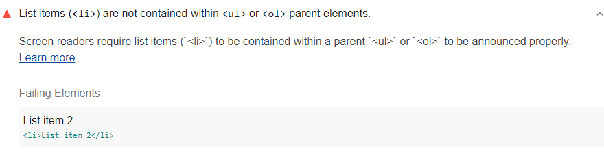

Screen readers require list items (`<li>`) to be contained
within parent `<ul>` or `<ol>` to be announced properly.
Lighthouse reports when list items (`<li>`) are not contained
within `<ul>` ' or `<ol>` parent elements:

<figure class="w-figure">
  
    Fig. 1 — List item isn't contained within a parent list
  </figcaption>
</figure>

## How to fix this problem

To fix this problem,
wrap any roque list items, <`li>`, inside a parent list,
`<ul>` or `<ol>`.

When screen readers come to a list,
they notify users how many items are within the list.
If you don't mark up lists using proper the proper list hierarchy,
the screen reader can't set user expectations accordingly.
Learn more in
[`<li>` elements must be contained in a `<ul>` or `<ol>`](https://dequeuniversity.com/rules/axe/3.2/listitem).

<!--
## How this audit impacts overall Lighthouse score

Todo. I have no idea how accessibility scoring is working!
-->
## More information

- [Ensure list items are contained within a parent list audit source](https://github.com/GoogleChrome/lighthouse/blob/master/lighthouse-core/audits/accessibility/listitem.js)
- [axe-core rule descriptions](https://github.com/dequelabs/axe-core/blob/develop/doc/rule-descriptions.md)
- [List of axe 3.2 rules](https://dequeuniversity.com/rules/axe/3.2)