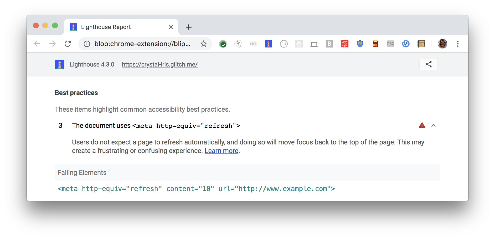

Users do not expect a page to refresh automatically,
and doing so will move focus back to the top of the page.
This may create a frustrating or confusing experience.
Lighthouse reports timed refreshes:

<figure class="w-figure">
  
  <figcaption class="w-figcaption">
    The document uses timed refresh.
  </figcaption>
</figure>

## How to fix this problem

To fix this problem,
don't automatically refresh the page.
Automatically refreshing the page disorientates users.
Refreshing also moves the programmatic focus back to the top of the page,
away from the user's focus.

To avoid automatically refreshing the page,
remove `<meta http-equiv="refresh">` from the page.
Learn more in
[Timed refresh must not exist](https://dequeuniversity.com/rules/axe/3.2/meta-refresh?application=lighthouse).

<!--
## How this audit impacts overall Lighthouse score

Todo. I have no idea how accessibility scoring is working!
-->
## More information

- [Do not use `<meta http-equiv="refresh">` audit source](https://github.com/GoogleChrome/lighthouse/blob/master/lighthouse-core/audits/accessibility/meta-refresh.js)
- [axe-core rule descriptions](https://github.com/dequelabs/axe-core/blob/develop/doc/rule-descriptions.md)
- [List of axe 3.2 rules](https://dequeuniversity.com/rules/axe/3.2)
