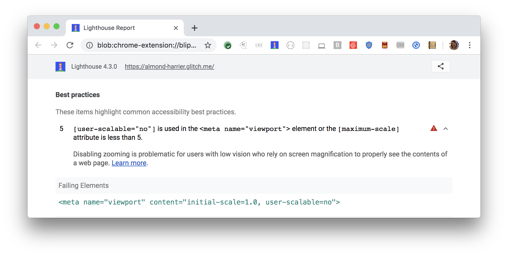

Disabling zooming is problematic for users with low vision
who rely on screen magnification to properly see the contents of a web page.
Lighthouse reports when the viewport disables text scaling and zooming:

<figure class="w-figure">
  
  <figcaption class="w-figcaption">
    The viewport disables text scaling and zooming.
</figure>

## How to fix this problem

To fix this problem,
remove `user-scalable="no"` parameter from the viewport and
ensure `maximum-scale parameter` isn't less than 5.

The `user-scalable="no"` parameter inside `<meta name="viewport">` element disables zooming on a page.
The `maximum-scale parameter` limits the amount the user can zoom.
Both are problematic for people with low vision who rely on screen magnifiers
to properly see the contents of a web page.

Learn more in
[Zooming and scaling must not be disabled](https://dequeuniversity.com/rules/axe/3.3/meta-viewport).

<!--
## How this audit impacts overall Lighthouse score

Todo. I have no idea how accessibility scoring is working!
-->
## More information

- [Do not disable text scaling and zooming audit source](https://github.com/GoogleChrome/lighthouse/blob/master/lighthouse-core/audits/accessibility/meta-viewport.js)
- [axe-core rule descriptions](https://github.com/dequelabs/axe-core/blob/develop/doc/rule-descriptions.md)
