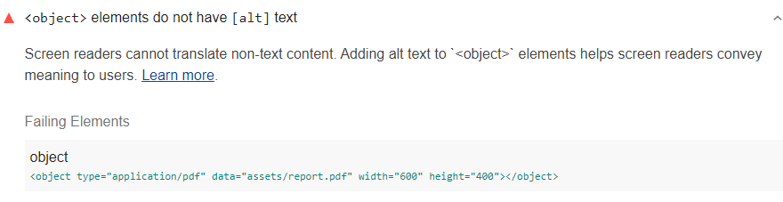

Screen readers cannot translate non-text content.
Adding alternative text to define `<object>` elements helps screen readers convey meaning to users.
Lighthouse reports when any `<object>` elements do not have alternative text:

<!--
***Todo*** Rob's docs in accessibility recommend describing objects in the inner text.
But the Lighthouse audit implies that it is checking for `alt` text.
Need to check how this audit fails.
Also need to talk with Rob the slight inconsistencies between
Rob's doc, the audit, and recommendations in deque docs.
-->
<figure class="w-figure">
   elements do not have alternative text">
  <figcaption class="w-figcaption">
    <code>&lt;object></code> elements do not have alternative text.
  </figcaption>
</figure>


## How to fix this problem

To fix this problem,
provide alternative text for every `<object>` element.
The alternative text describes the information contained in the embedded object
and goes inside the object element as regular text
like "Annual report" below:

```html
<object type="application/pdf"
    data="/report.pdf"
    width="600"
    height="400">
2019 Web Accessibility Report
</object>
```

Learn more in [Include text alternatives for images and objects](/labels-and-text-alternatives#include-text-alternatives-for-images-and-objects).


You can also use `alt` and ARIA labels to describe object elements,
for example,
`<object type="application/pdf" data="/report.pdf alt="2019 Web Accessibility Report">`
(see [&lt;object> elements must have alternate text](https://dequeuniversity.com/rules/axe/3.3/object-alt))


## Tips for writing effective `alt` text

- As previously mentioned, describe the information contained in the embedded object.
- Alternative text should give the intent, purpose, and meaning of the object.
- Blind users should get as much information from alternative text as a sighted user gets from the object.
- Avoid non-specific words like "chart", "image", or "diagram".

Learn more in
[WebAIM's guide to Alternative Text](https://webaim.org/techniques/alttext/).

<!--
## How this audit impacts overall Lighthouse score

Todo. I have no idea how accessibility scoring is working!
-->
## More information

- [Ensure `object` elements have alternative text audit source](https://github.com/GoogleChrome/lighthouse/blob/master/lighthouse-core/audits/accessibility/object-alt.js)
- [axe-core rule descriptions](https://github.com/dequelabs/axe-core/blob/develop/doc/rule-descriptions.md)
