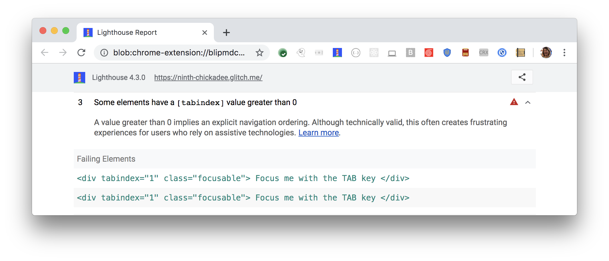

A `tabindex` value greater than 0 implies an explicit navigation ordering.
Although technically valid, this often creates frustrating experiences
for users who rely on assistive technologies.
Lighthouse reports when some elements have a `tabindex` value greater than 0:

<figure class="w-figure">
  
  <figcaption class="w-figcaption">
    Fig. 1 — Some elements have a `tabindex` value greater than 0
  </figcaption>
</figure>


## How to fix this problem

Using a `tabindex` greater than 0 is considered an anti-pattern
because screen readers navigate the page in DOM order, not tab order.
Any `tabindex` greater than 0 jumps the element to the front of the natural tab order.
This unexpected tab order can give the appearance of skipping some elements entirely.

If you have a `tabindex` greater than 0,
and you're using a native element,
remove the `tabindex` all together.
Native HTML elements such as `<button>` or `<input>`
have keyboard accessibility built-in for free.

If you're using custom interactive components,
set the `tabindex` to zero.
For example:

```html
<div tabindex="0">Focus me with the TAB key</div>
```

If you need an element to come sooner in the tab order,
it should be moved to an earlier spot in the DOM.
Learn more in
[Control focus with tabindex](/control-focus-with-tabindex).

<!--
## How this audit impacts overall Lighthouse score

Todo. I have no idea how accessibility scoring is working!
-->
## More information

- [Elements should not have tabindex greater than zero](https://dequeuniversity.com/rules/axe/3.2/tabindex)
- [Ensure `tabindex` values aren't greater than 0 audit source](https://github.com/GoogleChrome/lighthouse/blob/master/lighthouse-core/audits/accessibility/tabindex.js)
- [axe-core rule descriptions](https://github.com/dequelabs/axe-core/blob/develop/doc/rule-descriptions.md)
- [List of axe 3.2 rules](https://dequeuniversity.com/rules/axe/3.2)