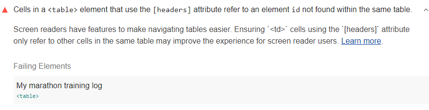

Screen readers announce the table headers when it comes to each table data cell.
If the headers and data cells don't match up,
it's very confusing to screen reader users.
Every table data cell must relate to the correct table header;
therefore, there should onlhy be one table header per column
Lighthouse reports when there's more than one table header per column:

<figure class="w-figure">
  
    There's more than one table header for a single column.
  </figcaption>
</figure>

## How to fix this problem

To fix this problem,
markup tables semantically and with the correct header structure.
Each table data cell must align with one table header cell.

The following table isn't structured correctly;
one column has multiple table headers:

```html
<table>
  <caption><strong>My marathon training log</strong></caption>
  <thead>
    <tr>
      <th>Week</th>
      <th>Total miles</th>
      <th>Longest run</th>
      <th>Long run pace</th>
    </tr>
  </thead>

  <tbody>
    <tr>
      <th header="Week">1</th>
      <td>14</td>
      <td>5</td>
      <td>12.30</td>
    </tr>

    <tr>
      <th>1</th>
      <td>16</td>
      <td>6</td>
      <td>12.15</td>
    </tr>

  </tbody>

</table>
```

To fix this table,
remove `header="Week"` and
apply the `scope` attribute to our header column and table rows.

The scope attribute tells the browser and screen reader that everything under the column
is related to the header at the top,
and everything to the right of the row header is related to that header.
Learn more in
[All cells in a `<table>` element that use the headers attribute must only refer to other cells of that same `<table>`](https://dequeuniversity.com/rules/axe/3.3/td-headers-attr).

Also add the missing `<td>` to the first row in the body,
so that the table data aligns correctly with the table headers:

```html
<table>
  <caption><strong>My marathon training log</strong></caption>
  <thead>
    <tr>
      <th scope="col">Week</th>
      <th scope="col">Total miles</th>
      <th scope="col">Longest run</th>
      <th scope="col">Long run pace</th>
    </tr>
  </thead>

  <tbody>
    <tr>
      <th scope="row">1</th>
      <td>14</td>
      <td>5</td>
      <td>12.30</td>
    </tr>

    <tr>
      <th scope="row">1</th>
      <td>16</td>
      <td>6</td>
      <td>12.15</td>
    </tr>

  </tbody>

</table>
```

<!--
## How this audit impacts overall Lighthouse score

Todo. I have no idea how accessibility scoring is working!
-->
## More information

- [Ensure there's only one table header per table column audit source](https://github.com/GoogleChrome/lighthouse/blob/master/lighthouse-core/audits/accessibility/td-headers-attr.js)
- [axe-core rule descriptions](https://github.com/dequelabs/axe-core/blob/develop/doc/rule-descriptions.md)
