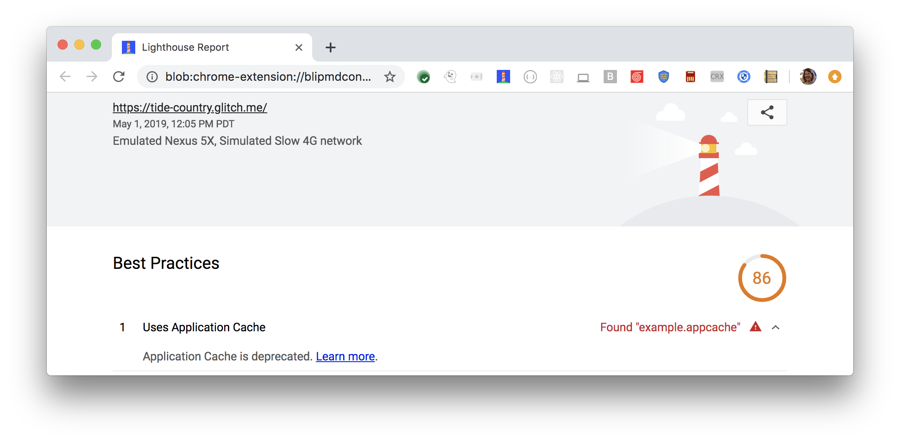

Application Cache, also known as AppCache,
is [deprecated](https://html.spec.whatwg.org/multipage/browsers.html#offline).
Lighthouse flags documents that use AppCache:

<figure class="w-figure">
  
  <figcaption class="w-figcaption">
    Fig. 1 — Document uses AppCache
  </figcaption>
</figure>

## How this audit fails

Lighthouse fails this audit when it finds a reference
to the AppCache manifest on the document's html tag.
For example,
this markup in your document causes the audit to fail:

```html
<html manifest="example.appcache">
  ...
</html>
```

## Use the Cache API instead of AppCache

To pass this audit,
remove the manifest from your document,
and use the 
[service worker Cache API](https://developer.mozilla.org/en-US/docs/Web/API/Cache) instead.

To help migrate from AppCache to service workers,
consider using the
[sw-appcache-behavior library](https://github.com/GoogleChrome/sw-appcache-behavior).
This library generates a service-worker-based implementation of the behavior
defined in an AppCache manifest.

See the [URL Responds With a 200 When Offline](/works-offline) audit
reference for more resources on using service workers to make your site work
offline.



## More information

[Page uses appcache audit source](https://github.com/GoogleChrome/lighthouse/blob/ecd10efc8230f6f772e672cd4b05e8fbc8a3112d/lighthouse-core/audits/dobetterweb/appcache-manifest.js)