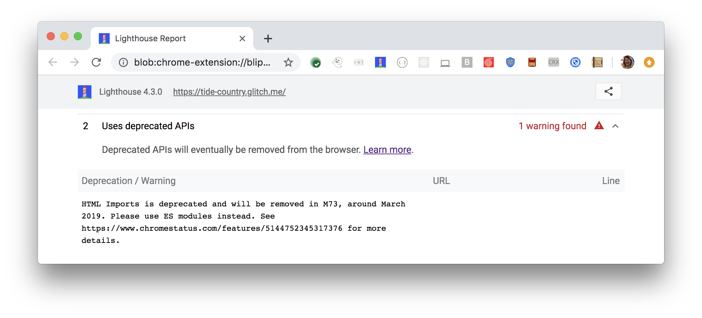

Deprecated APIs are scheduled to be removed from Chrome.
Calling these APIs
after they're removed causes errors on your site.
Lighthouse flags the deprecated APIs:

<figure class="w-figure">
  
</figure>

## How this audit fails

Lighthouse collects the deprecated API warnings that Chrome logs
to the DevTools Console and includes them in the Lighthouse repot as warnings.



## How to remove deprecated APIs

Go to
[Chrome Platform Status](https://www.chromestatus.com/features#deprecated) and
expand the entries for the APIs that you're using
to learn more about why the APIs are deprecated,
as well as how to replace them.

## Resources

[Source code for **Uses deprecated APIs** audit](https://github.com/GoogleChrome/lighthouse/blob/master/lighthouse-core/audits/deprecations.js)
