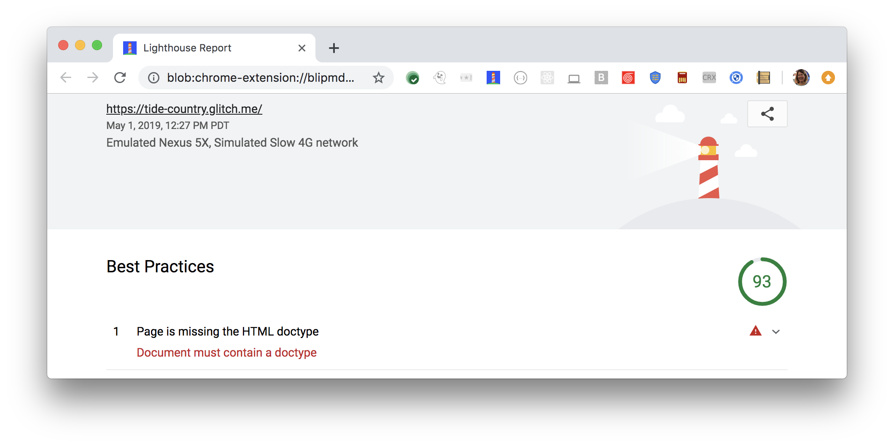

Specifying a doctype prevents the browser from switching to
[quirks-mode](https://developer.mozilla.org/en-US/docs/Web/HTML/Quirks_Mode_and_Standards_Mode).
Lighthouse flags your page when it's missing `<!DOCTYPE html>`:

<figure class="w-figure">
  
  <figcaption class="w-figcaption">
    Document missing doctype.
  </figcaption>
</figure>

## How to pass this audit

To pass this audit,
add `<!DOCTYPE html>`.

Learn more in [Doctype](https://developer.mozilla.org/en-US/docs/Glossary/Doctype).



## More information

[Document missing doctype audit source](https://github.com/GoogleChrome/lighthouse/blob/ecd10efc8230f6f772e672cd4b05e8fbc8a3112d/lighthouse-core/audits/dobetterweb/doctype.js)
