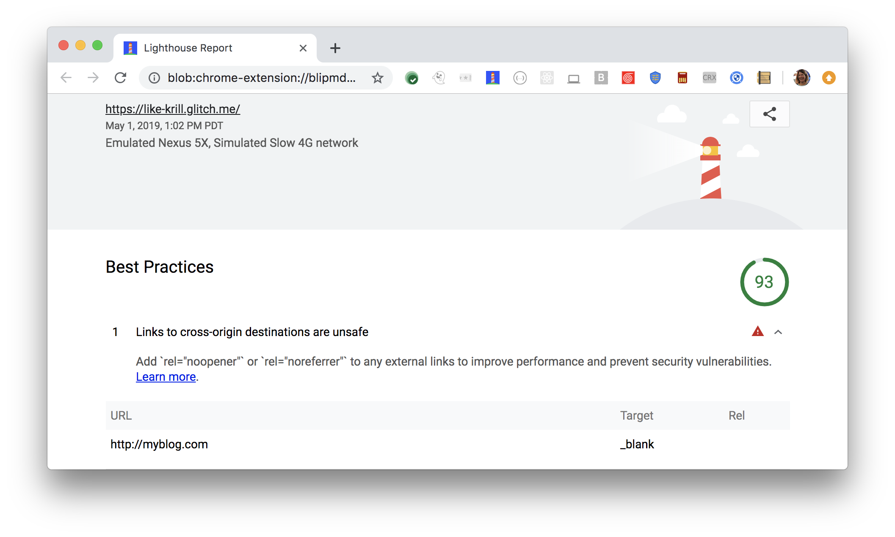

Lighthouse flags any links to cross-origin destinations that are unsafe:

<figure class="w-figure">
  
  <figcaption class="w-figcaption">
    Links to cross-origin destinations are unsafe.
  </figcaption>
</figure>

## How this audit fails

Lighthouse uses the following algorithm to flag links as `rel="noopener"`
candidates:

1. Gather all `<a>` nodes that contain the attribute `target="_blank"` and do not contain the attribute `rel="noopener"` or `rel="noreferrer"`.
2. Filter out any same-host links.

Because Lighthouse filters out same-host links,
there's an edge case that you might want to be aware of if you're working on a large site.
If your page opens a link to another section of your site without using `rel="noopener"`,
the performance implications of this audit still apply.
However, you won't see these links in your Lighthouse results.



## How links to cross-origin destinations slow down your page

When you open another page using `target="_blank"`, the other page may
run on the same process as your page, unless [Site Isolation](https://developers.google.com/web/updates/2018/07/site-isolation) is enabled.
If the other page is running a lot of JavaScript, your page's performance may
also suffer. See [The Performance Benefits of `rel=noopener`](https://jakearchibald.com/2016/performance-benefits-of-rel-noopener/).

## How links to cross-origin destinations introduce security vulnerabilities

The other page can access your `window` object with the `window.opener` property.
This exposes an [attack surface](https://en.wikipedia.org/wiki/Attack_surface) because the other page
can potentially redirect your page to a malicious URL.

Learn more in [Share cross-origin resources safely](/cross-origin-resource-sharing/).

## Improve your site's performance and prevent security vulnerabilities

Improve your site's performance and prevent security vulnerabilities
by adding `rel="noopener"` or `rel="noreferrer"`
to each link identified in your Lighthouse report.
In general, when you use `target="_blank"`, always
add `rel="noopener"` or `rel="noreferrer"`:

```html
<a href="https://examplepetstore.com" target="_blank" rel="noopener">
  Example Pet Store
</a>
```

- `rel="noopener"` prevents the new page from being able
to access the `window.opener` property and
ensures it runs in a separate process.
- `rel="noreferrer"` attribute has the same effect,
but also prevents the `Referer` header
from being sent to the new page.
See [Link type "noreferrer"](https://html.spec.whatwg.org/multipage/links.html#link-type-noreferrer).

## More information

[Unsafe links to cross-origin destinations audit source](https://github.com/GoogleChrome/lighthouse/blob/master/lighthouse-core/audits/dobetterweb/external-anchors-use-rel-noopener.js)
