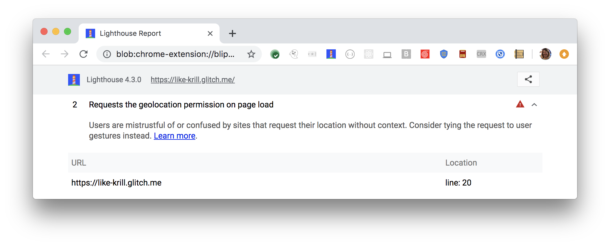

Users are mistrustful of or confused by pages
that automatically request their location on page load.
Lighthouse flags when pages request geolocation permission on load:

<figure class="w-figure">
  
  <figcaption class="w-figcaption">
    Fig. 1 — Page requests geolocation on load
  </figcaption>
</figure>

## How this audit fails

Lighthouse collects the JavaScript that was executed on page load.
If this code contains calls to `geolocation.getCurrentPosition()` or
`geolocation.watchPosition()`, and geolocation permission was not already granted,
then Lighthouse fails the audit.

Under **URLs**,
Lighthouse reports the line and column numbers
where your code is requesting the user's location.
Remove these calls, 
and tie the requests to user gestures instead. 

If geolocation permission was already granted to a page before Lighthouse's audit,
Lighthouse cannot determine if the page requests the user's location on page load.
Reset the permissions and run Lighthouse again.
See [Change website permissions](https://support.google.com/chrome/answer/6148059) for more help.



## How to ask for user's location responsibly

- Assume users won't give you their location.
- Use a fallback if geolocation is required.
- Always request access to location on a user gesture,
not on page load.
- Give a clear indication that the action requests their location.

Learn more in
[Ask permission responsibly](https://developers.google.com/web/fundamentals/native-hardware/user-location/#ask_permission_responsibly).



## More information

[Page requests geolocation on load audit source](https://github.com/GoogleChrome/lighthouse/blob/master/lighthouse-core/audits/dobetterweb/geolocation-on-start.js)
