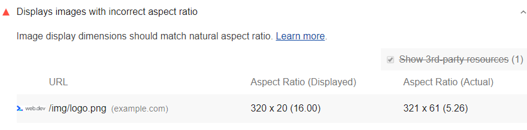

If a rendered image has a significantly different aspect ratio
from the aspect ratio in its source file (the "natural" aspect ratio),
then the rendered image may look distorted,
possibly creating an unpleasant user experience.
Lighthouse flags images with incorrect aspect ratios.

## How the Lighthouse image aspect ratio audit fails

Lighthouse flags any image with a rendered aspect ratio
5 percent or more different than its natural ratio.

<figure class="w-figure">
  
</figure>

There are two common causes for an incorrect image aspect ratio:

- Images are set to explicit width and height values that differ from the source image's dimensions.
- Images are set to a width and height as a percentage of a variably-sized container.



## Ensure images display with correct aspect ratio

When possible, it's a good practice to specify image width and height in HTML,
so that the browser can allocate space for the image.
In practice,
this approach can be difficult if you're working with responsive images,
because there's no way to specify width and height until you know the viewport dimensions.

Consider using [css-aspect-ratio](https://www.npmjs.com/package/css-aspect-ratio) or
[Aspect Ratio Boxes](https://css-tricks.com/aspect-ratio-boxes/)
to help preserve aspect ratios.
Chrome DevTools can show you the CSS declarations that affect an image's aspect ratio.
See [View only the CSS that's actually applied to an element](https://developers.google.com/web/tools/chrome-devtools/css/reference#computed).

Learn more in [Serve images with correct dimensions](/serve-images-with-correct-dimensions).

## Resources

- [Source code for **Displays images with incorrect aspect ratio** audit](https://github.com/GoogleChrome/lighthouse/blob/master/lighthouse-core/audits/image-aspect-ratio.js)
- [Properly size images audit]()

  

    <h2 class="w-codelabs-callout__lockup">Codelabs</h2>
    
See it in action

    

      Learn more and put this guide into action.
    

  

  <ul class="w-unstyled-list w-codelabs-callout__list">
    <li class="w-codelabs-callout__listitem">
      <a class="w-codelabs-callout__link" href="/codelab-serve-images-correct-dimensions">
        Serve images with correct dimensions
      </a>
    </li>
  </ul>

