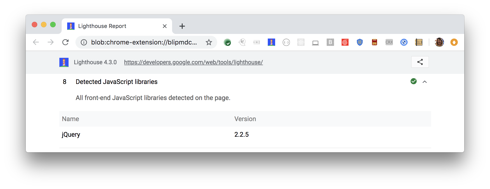

Lighthouse lists all front-end JavaScript libraries detected on the page:

<figure class="w-figure">
  
  <figcaption class="w-figcaption">
    Fig. 1 — Page uses these front-end JavaScript libraries
  </figcaption>
</figure>

## This is a diagnostic audit

This audit simply lists all front-end JavaScript libraries.
Lighthouse also reports
[front-end JavaScript libraries with known security risks](/no-vulnerable-libraries).
Watch closely for these vulnerabities.



## More information

[Page uses these front-end JS libraries audit source](https://github.com/GoogleChrome/lighthouse/blob/ecd10efc8230f6f772e672cd4b05e8fbc8a3112d/lighthouse-core/audits/dobetterweb/js-libraries.js)
