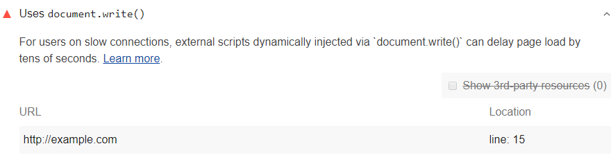

For users on slow connections,
such as 2G, 3G, or slow Wi-Fi,
external scripts dynamically injected via `document.write()`
can delay the display of main page content by tens of seconds.
Lighthouse lists out every call to `document.write()`:

<figure class="w-figure">
  
  <figcaption class="w-figcaption">
    Fig. 1 — Page uses <code>document.write()</code>
  </figcaption>
</figure>

See [Intervening against `document.write()`](https://developers.google.com/web/updates/2016/08/removing-document-write)
to learn more.

## How this audit fails

Lighthouse reports every instance of `document.write()` that it encounters.
Chrome's intervention against `document.write()` only applies
to render-blocking, dynamically-injected scripts.
Other uses of `document.write()` may be acceptable.



## Avoid `document.write()`

Review the usage of `document.write()`.
If the script meets the criteria outlined in the introduction to
[Intervening against `document.write()`](https://developers.google.com/web/updates/2016/08/removing-document-write), 
Chrome won't execute the injected script.
These are the calls to `document.write()` that you want to change.

See [How do I fix this?](https://developers.google.com/web/updates/2016/08/removing-document-write#how_do_i_fix_this) for possible solutions. 

## More information

[Page uses `document.write()` audit source](https://github.com/GoogleChrome/lighthouse/blob/master/lighthouse-core/audits/dobetterweb/no-document-write.js)

