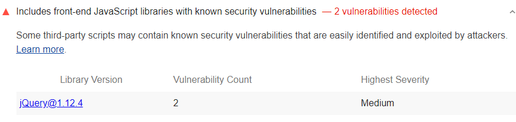

Intruders have automated web crawlers that can scan your site
for known security vulnerabilities.
When the web crawler detects a vulnerability,
it alerts the intruder.
From there,
the intruder just needs to figure out how to exploit the vulnerability on your site.
Lighthouse flags front-end JavaScript libraries with known security vulnerabilities:

<figure class="w-figure">
  
  <figcaption class="w-figcaption">
    Fig. 1 — Page uses front-end JavaScript libraries with security vulnerabilities
  </figcaption>
</figure>

## How this audit fails

To detect vulnerable libraries, Lighthouse:

- Runs [Library Detector For Chrome](https://www.npmjs.com/package/js-library-detector).
- Checks the list of detected libraries against
[Snyk's Vulnerability DB](https://snyk.io/vuln?packageManager=all).



## Stop using these JavaScript libraries

An intruder can scan your entire site using a web crawler.

Stop using each of the libraries that Lighthouse flags.
If the library has released a newer version that fixes the vulnerability,
upgrade to that version, or consider using a different library.

See [Snyk's Vulnerability DB](https://snyk.io/vuln?packageManager=all)
to learn more about each library's vulnerability.

## More information

[Includes vulnerabe JS libraries audit source](https://github.com/GoogleChrome/lighthouse/blob/master/lighthouse-core/audits/dobetterweb/no-vulnerable-libraries.js)