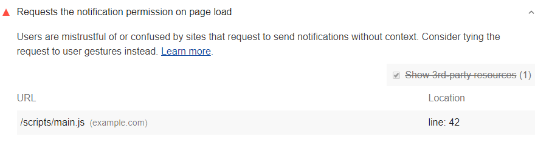

As explained in
[What Makes a Good Notification](https://developers.google.com/web/fundamentals/push-notifications/),
good notifications are timely, relevant, and precise.
If your page asks for permission to send notifications on page load,
those notifications may not be relevant to your users or precise to their needs.
Lighthouse flags when pages request notification permissions on load:

<figure class="w-figure">
  
  <figcaption class="w-figcaption">
    Page requests notification permissions on load.
  </figcaption>
</figure>

## How this audit fails

Lighthouse collects the JavaScript that was executed on page load.
If this code contains calls to `notification.requestPermission()`,
and notification permission was not already granted,
then Lighthouse fails the audit.

Under **URLs**, Lighthouse reports the line and column numbers
where your code is requesting permission to send notifications.
Remove these calls,
and tie the requests to user gestures instead.

If notification permissions was already granted or denied
to a page before Lighthouse's audit,
Lighthouse cannot determine
if the page requests notification permissions on page load.
Reset the permissions and run Lighthouse again.



## Ask for user's notification permissions responsibly

A better user experience is to offer to send users a specific type of notification,
and to present the permissions request after they opt-in.

See [Change website permissions](https://support.google.com/chrome/answer/6148059) for more help.

## More information

[Page requests notification permissions on load audit source](https://github.com/GoogleChrome/lighthouse/blob/master/lighthouse-core/audits/dobetterweb/notification-on-start.js)
