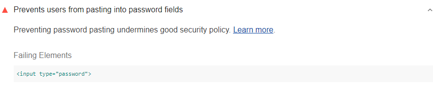

Some websites claim that preventing users
from pasting passwords somehow improves security.
In
[Let Them Paste Passwords](https://www.ncsc.gov.uk/blog-post/let-them-paste-passwords),
the National Cyber Security Centre says that this claim is unfounded.
Password pasting improves security because it enables users to use password managers.
Lighthouse flags code that's preventing users from pasting into password fields.

<!--***Todo***
Can't seem to get this audit to fail.
Created a form with password and followed advice
to include preventDefault and it doesn't seem to work.
Post-IO fix.

<figure class="w-figure">
  
  <figcaption class="w-figcaption">
    Page stops users from pasting into password fields.
  </figcaption>
</figure>
-->

## How this audit fails

Lighthouse gathers all `<input type="password">` elements,
pastes some text into each element,
and then verifies that the element's content has been set to the pasted text.

If a page doesn't use `<input type="password">` for its password input fields,
Lighthouse doesn't detect those elements.
It's also possible to prevent pasting outside of a `paste` event listener.
Lighthouse doesn't detect that scenario, either.



## Find and inspect the code that's preventing pasting

To quickly find and inspect the code that's preventing pasting,
try enabling the **Clipboard** > `paste` checkbox in the
[Event Listener Breakpoints](https://developers.google.com/web/tools/chrome-devtools/javascript/breakpoints#event-listeners)
section of Chrome DevTools,
then pasting into a password field.
DevTools should pause on the first line of code in the `paste` event listener.

## How to enable users to paste into password fields

Remove the code that's preventing users from pasting into password fields.
It's probably a call to `preventDefault()` within the `paste` event listener
that's associated to the password input element.

```js
let input = document.querySelector('input');
input.addEventListener('paste', (e) => {
  e.preventDefault(); // This is what prevents pasting.
});
```

## Why users should be able to paste into password fields

Password managers typically generate strong passwords for users,
store them securely, and then automatically paste them
into password fields whenever users need to log in.

See [The "Cobra Effect" That Is Disabling Paste On Password Fields](https://www.troyhunt.com/the-cobra-effect-that-is-disabling/)
for more on why enabling pasting is a better security practice.

## More information

[Page stops users from pasting into password fields audit source](https://github.com/GoogleChrome/lighthouse/blob/master/lighthouse-core/audits/dobetterweb/password-inputs-can-be-pasted-into.js)
