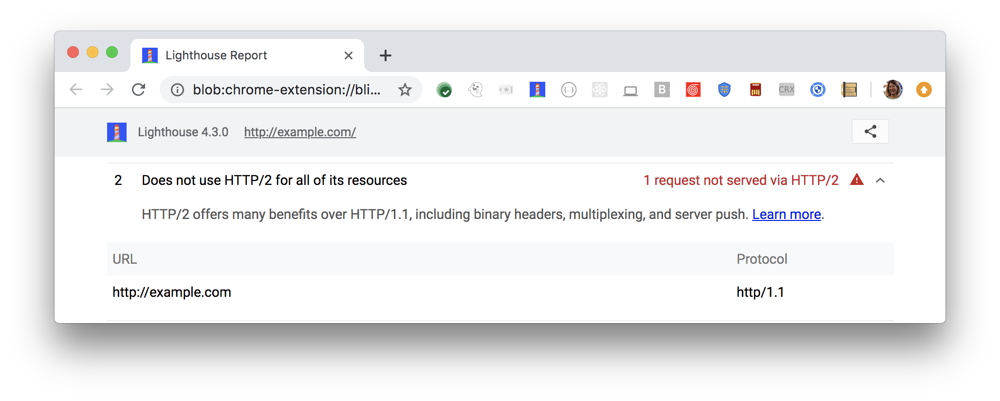

HTTP/2 serves your page's resources faster,
and with less data moving over the wire.
Lighthouse lists every resource that was not served over HTTP/2:

<figure class="w-figure">
  
  <figcaption class="w-figcaption">
    Fig. 1 — Resources not served over HTTP/2
  </figcaption>
</figure>

## How this audit fails

Lighthouse gathers all of the resources that are
from the same host as the page,
and then checks the HTTP protocol version of each resource.

Lighthouse excludes resources from other hosts from this audit,
because it assumes that you have no control
over how these resources are served.

## How to pass this audit

To pass this audit, serve each of those resources over HTTP/2.

To learn how to enable HTTP/2 on your servers,
see [Setting Up HTTP/2](https://dassur.ma/things/h2setup/).



## More information

- [Page doesn't use HTTP/2 for its own resources audit source](https://github.com/GoogleChrome/lighthouse/blob/master/lighthouse-core/audits/dobetterweb/uses-http2.js)
- [Introduction to HTTP/2](https://developers.google.com/web/fundamentals/performance/http2/)
- [HTTP/2 Frequently Asked Question](https://http2.github.io/faq/)

