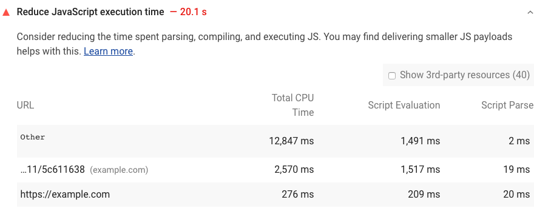

Lighthouse reports the time spent executing JavaScript files during page load
in the Diagnostics section:

<figure class="w-figure">
  
  <figcaption class="w-figcaption">
    Reduce JavaScript execution time.
  </figcaption>
</figure>

## How JavaScript execution slows down performance

JavaScript execution can slow down your performance in many ways:

- Network cost. More bytes equals longer download times.
- Parse and compile cost. JavaScript gets parsed and compiled on the main thread.
When the main thread is busy, the page can't respond to user input.
- Execution cost. JavaScript is also executed on the main thread.
If your page runs a lot of code before it's really needed,
that also delays your [Time To Interactive](/interactive),
which is one of the key metrics related to how users perceive your page speed.
- Memory cost. If your JavaScript holds on to a lot of references,
it can potentially consume a lot of memory.
Pages appear janky or slow when they consume a lot of memory.
Memory leaks can cause your page to freeze up completely.

## Ways to speed up improve JavaScript execution

- Only send the code that your users need (see
[Reduce JavaScript payloads with code splitting](/reduce-javascript-payloads-with-code-splitting)).
- Minify and compress your code (see
[Minify and compress network payloads](/reduce-network-payloads-using-text-compression)).
- Remove unused code (see [Remove unused code](/remove-unused-code)).
- Cache your code to reduce network trips (see
[Apply instant loading with the PRPL pattern](/apply-instant-loading-with-prpl)).

## More information

- [Reduce JavaScript execution time audit source](https://github.com/GoogleChrome/lighthouse/blob/master/lighthouse-core/audits/bootup-time.js)
