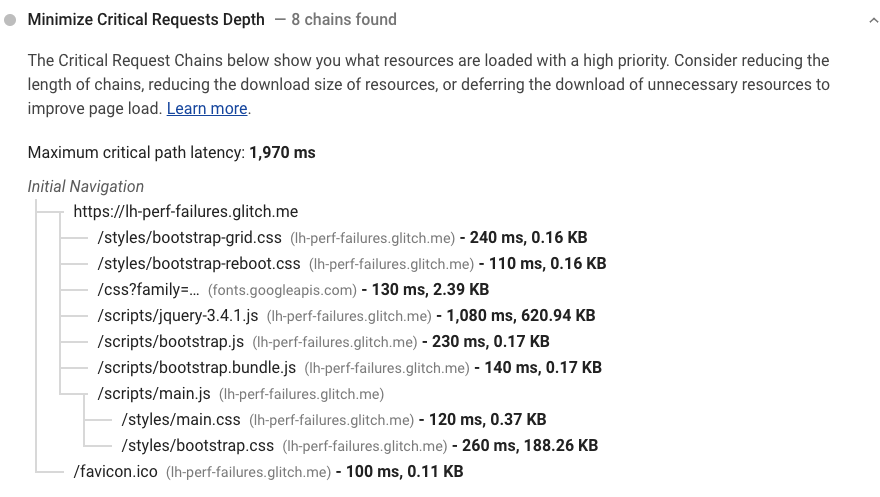

Critical request chains are series of dependent network requests important for page rendering.
The greater the length of the chains and the larger the download sizes,
them ore significant the impact on page load performance.
Lighthouse reports the critical requests loaded with a high priority in the Diagnostics section:

<figure class="w-figure">
  
  <figcaption class="w-figcaption">
    Minimize critical requests depth.
  </figcaption>
</figure>

## How Lighthouse determines the critical request chains

Lighthouse uses network priority as a proxy for identifying render-blocking critical resources.
See [Chrome Resource Priorities and Scheduling](https://docs.google.com/document/d/1bCDuq9H1ih9iNjgzyAL0gpwNFiEP4TZS-YLRp_RuMlc/edit)
for more information on how Chrome defines these priorities.

Data on critical request chains, resource sizes,
and time spent downloading resources is extracted from the
[Chrome Debugger Protocol](https://github.com/ChromeDevTools/devtools-protocol).

## Ways to reduce impact of critical request chains on performance

Use the critical request chains audit results to target the most effective resources first:

- Minimizing the number of critical resources: eliminating them, deferring their download, marking them as async, and so on.
- Optimizing the number of critical bytes to reduce the download time (number of roundtrips).
- Optimizing the order in which the remaining critical resources are loaded: downloading all critical assets as early as possible to shorten the critical path length.

Learn more about optimizing your
[images](/use-imagemin-to-compress-images),
[JavaScript](/apply-instant-loading-with-prp),
[CSS](/defer-non-critical-css), and
[web fonts](/avoid-invisible-text).

## More information

- [Minimize critical requests depth audit source](https://github.com/GoogleChrome/lighthouse/blob/master/lighthouse-core/audits/critical-request-chains.js)
