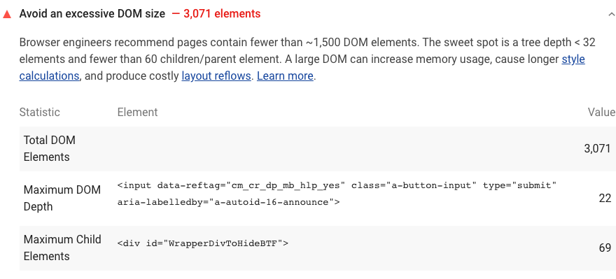

Lighthouse reports the total DOM elements for a page, it's maximum DOM depth,
and it's maximum child elements in the Diagnostics section:
<figure class="w-figure">
  
  <figcaption class="w-figcaption">
    Avoids an excessive DOM size.
  </figcaption>
</figure>

## How large DOMs can effect performance

A large DOM tree can harm your page performance in multiple ways:

- Network efficiency and load performance.
If you server ships a large DOM tree, you may be shipping lots of unnecessary bytes.
This can also slow down page load time,
because the browser may be parsing lots of nodes that aren't even displayed above-the-fold.
- Runtime performance.
As users and scripts interact with your page,
the browser must constantly
[re-compute the position and styling of nodes](https://developers.google.com/web/fundamentals/performance/rendering/reduce-the-scope-and-complexity-of-style-calculations?utm_source=lighthouse&utm_medium=cli).
A large DOM tree in combination with complicated style rules can severely slow down rendering.
- Memory performance.
If you use general query selectors such as `document.querySelectorAll('li')`
you may be unknowingly storing references to a very large number of nodes,
which can overwhelm the memory capabilities of your users' devices.

## How to optimize the DOM size

An optimal DOM tree:

- Has less than 1500 nodes total.
- Has a maximum depth of 32 nodes.
- Has no parent node with more than 60 child nodes.

In general,
look for ways to create DOM nodes only when needed,
and destroy them when no longer needed.

If your server ships a large DOM tree,
try loading your page and manually noting which nodes are displayed.
Perhaps you can remove the undisplayed nodes from the loaded document,
and only create them after a user gesture, such as a scroll or a button click.

If you create DOM nodes at runtime,
[Subtree Modification DOM Change Breakpoints](https://developers.google.com/web/tools/chrome-devtools/javascript/breakpoints#dom)
can help you pinpoint when nodes get created.

If you can't avoid a large DOM tree,
another approach for improving rendering performance is simplifying your CSS selectors.
See [Reduce The Scope And Complexity Of Style Calculations](https://developers.google.com/web/fundamentals/performance/rendering/reduce-the-scope-and-complexity-of-style-calculations).

## More information

- [Avoids an excessive DOM size audit source](https://github.com/GoogleChrome/lighthouse/blob/master/lighthouse-core/audits/dobetterweb/dom-size.js)
