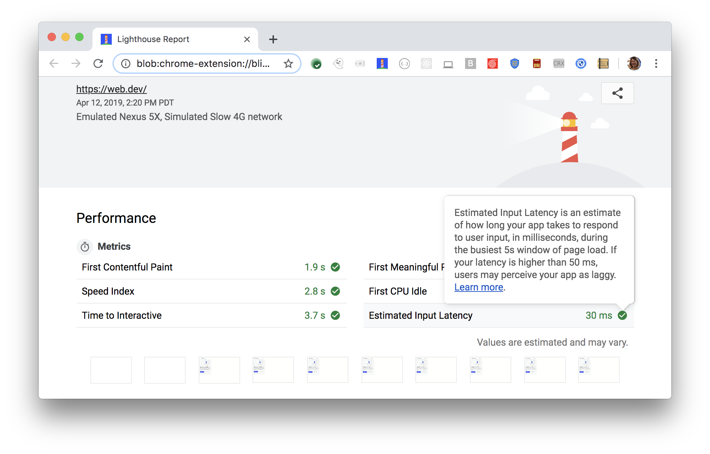

Estimated Input Latency is one of six metrics tracked in the performance section of the Lighthouse report.
Each of these metrics captures some aspect of page load speed.
The Lighthouse reports displays the Estimated Input Latency time period in milliseconds:

<figure class="w-figure">
  
  <figcaption class="w-figcaption">
    Estimated Input Latency.
  </figcaption>
</figure>

## What does Estimated Input Latency measure

Estimated Input Latency is an estimate of how long your app takes to respond to user input,
during the busiest 5s window of page load.
The timing of this audit is from
[First Meaningful Paint](/first-meaningful-paint)
to the end of the trace which is roughly 5 seconds after
[Time to Interactive](/interactive).
If your latency is higher than 50 ms, users may perceive your app as laggy.

The [RAIL performance model](https://developers.google.com/web/fundamentals/performance/rail)
recommends that apps respond to user input within 100ms,
whereas Lighthouse's Estimated Input Latency target score is 50ms. Why?
Lighthouse uses a proxy metric,
availability of the main thread,
to measure how well your app responds to user input.

Lighthouse assumes that your app needs 50ms to completely respond to the user's input
(from performing any JavaScript executions to physically painting the new pixels to the screen).
If your main thread is unavailable for 50ms or more,
that does not leave enough time for your app to complete the response.

There is a 90% probability a user would encounter input latency of the amount that Lighthouse reports, or less.
10% of users can expect additional latency.

## How to improve the Estimated Input Latency metric

To make your app respond to user input faster,
you need to optimize how your code runs in the browser.
Check out the series of techniques outlined in the
[Rendering Performance docs](https://developers.google.com/web/fundamentals/performance/rendering/).
These tips range from offloading computation to web workers in order to free up the main thread,
to refactoring your CSS selectors to perform less calculations,
to using CSS properties that minimize the amount of browser-intensive operations.

One important caveat of this audit is that it's not a complete measurement of input latency.
This audit does not measure how long your app truly takes to respond to a user input;
it does not measure that your app's response to the user's input is visually complete.

## How to measure Estimated Input Latency manually

To measure Estimated Input Latency manually,
make a recording with the Chrome DevTools Timeline.
See [Do less main thread work](https://developers.google.com/web/tools/chrome-devtools/speed/get-started#main)
for an example of the workflow.
The basic idea is to start a recording, perform the user input that you want to measure,
stop the recording, and then analyze the flame chart to ensure that
[all stages of the pixel pipeline](https://developers.google.com/web/fundamentals/performance/rendering/#the_pixel_pipeline)
are complete within 50ms.

## More information

- [Estimated Input Latency audit source](https://github.com/GoogleChrome/lighthouse/blob/master/lighthouse-core/audits/metrics/estimated-input-latency.js)
