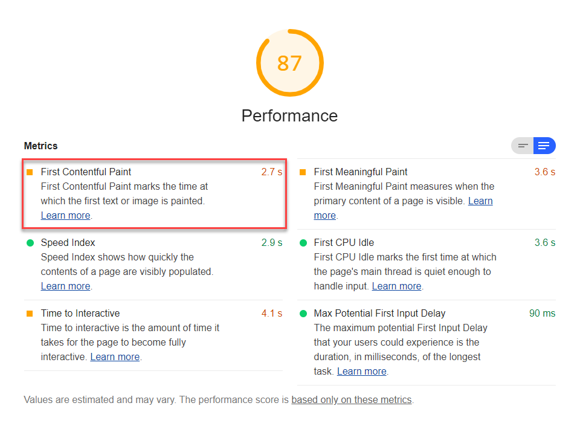

First Contentful Paint (FCP) is one of six metrics tracked in the performance section of the Lighthouse report.
Each of these metrics captures some aspect of page load speed.
The Lighthouse reports displays the FCP time period in seconds:

<figure class="w-figure">
  
  <figcaption class="w-figcaption">
    First Contentful Paint.
  </figcaption>
</figure>

## What does FCP measure

FCP specifically captures the time from navigation to when the browser renders the first bit of content from the DOM.
As explained in the [Paint Timing specification](https://w3c.github.io/paint-timing/#first-contentful-paint),
it reports the "time when the browser first renders any text, image (including background images), non-white canvas or SVG". FCP doesn't include the time it takes for content to appear within an iframe, but it does include text with pending web fonts.

## How Lighthouse determines your FCP score

In order to be able to calculate your overall performance score,
Lighthouse assigns each performance metric an individual score between 0–100.
The FCP score, in it's simplest terms, is based on a comparison between how fast your FCP is,
compared to [FCP metrics of real website performance data on
HTTParchive](https://httparchive.org/reports/loading-speed#fcp).

For example, sites performing in the top 99 percentile render FCP in about 1.5 seconds.
If your website's FCP is 1.5 seconds,
your FCP score is 99. This table helps explain how to interpret your FCP score:

  <table>
    <thead>
      <tr>
        <th>FCP metric (in seconds)</th>
        <th>Color-coding</th>
        <th>FCP score (HTTParchive %-tile)</th>
      </tr>
    </thead>
    <tbody>
      <tr>
        <td>0–2 seconds</td>
        <td>Green (fast)</td>
        <td>75–100</td>
      </tr>
      <tr>
        <td>2–4 seconds</td>
        <td>Orange (average)</td>
        <td>50–74</td>
      </tr>
      <tr>
        <td>Over 4 seconds</td>
        <td>Red (slow)</td>
        <td>0–49</td>
      </tr>
    </tbody>
    <caption>FCP metric compared to FCP score.</caption>
  </table>

## How your FCP score impacts overall performance score

The overall Lighthouse performance score is a weighted-average of the performance metrics, including FCP, as well as,
[First Meaningful Paint](/first-meaningful-paint), [First CPU Idle](/first-cpu-idle), [Time to Interactive](/interactive), and [Speed Index](/speed-index).

Heavier-weighted metrics have a larger impact on the overall performance score.
FCP is weighted 3 out of 5, which means it has an average impact on the overall performance score
(see [Scoring Details](https://docs.google.com/spreadsheets/d/1Cxzhy5ecqJCucdf1M0iOzM8mIxNc7mmx107o5nj38Eo/edit#gid=0) for specifics).

Try also the [Scoring Calculator](https://docs.google.com/spreadsheets/d/1Cxzhy5ecqJCucdf1M0iOzM8mIxNc7mmx107o5nj38Eo/edit#gid=283330180) to get a better sense of how Lighthouse scoring works.

## How to improve your performance score

Improving your Lighthouse performance score
isn't so much about tackling one performance metric at a time,
but seeing page load speed more holistic.
Anything you do to improve page load speed, will improve not just one performance metric,
but quite likely all of these metrics.

The most effective way to improve your performance score
is to fix the load opportunities highlighted in your Lighthouse report.
The more significant the opportunity,
the greater impact it will have on improving your performance score.

<figure class="w-figure">
  
  <figcaption class="w-figcaption">
    Opportunities section.
  </figcaption>
</figure>

For example,
[Eliminate render-blocking resources](/render-blocking-resources)
shows opportunities to improve page load speed (in seconds).
Eliminate any one or all of the blocking resources, and not only will your FCP score improve,
but so will additional performance metrics, and your overall Lighthouse performance score.

In addition to the potential savings in the Opportunities section of the Lighthouse report,
one Diagnostics audit of importance to FCP is
[Ensure text remains visible during webfont load](/font-display).
Font loads can significantly impact FCP so
look for ways to speed up them up.

Learn more about these potential savings from the [Performance audits landing page](/lighthouse-performance).

## Tracking FCP on real user's devices

To measure when FCP actually occurs on your users' devices,
see [Tracking FP/FCP](https://developers.google.com/web/fundamentals/performance/user-centric-performance-metrics#tracking_fpfcp).
This section describes how to programmatically access FCP data and submit it to Google Analytics.

See [Assessing Loading Performance in Real Life with Navigation and Resource Timing](https://developers.google.com/web/fundamentals/performance/navigation-and-resource-timing/)
for more on collecting real-user metrics.

## More information

- [FCP audit source](https://github.com/GoogleChrome/lighthouse/blob/master/lighthouse-core/audits/metrics/first-contentful-paint.js)
- [Paint Timing specification](https://w3c.github.io/paint-timing)
- [Lighthouse v3 Scoring Guide](https://developers.google.com/web/tools/lighthouse/v3/scoring)
