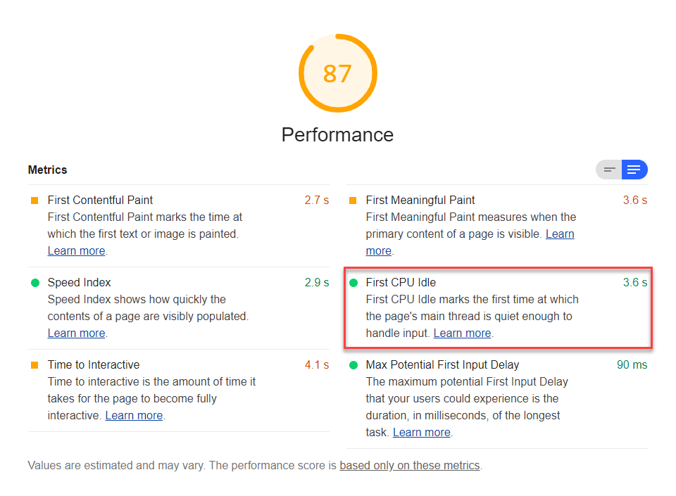

First CPU Idle is one of six metrics tracked in the performance section of the Lighthouse report.
Each of these metrics captures some aspect of page load speed.
The Lighthouse reports displays the First CPU Idle time period in seconds:

<figure class="w-figure">
  
  <figcaption class="w-figcaption">
    First CPU Idle.
  </figcaption>
</figure>

## What does First CPU Idle measure

First CPU Idle measures when a page is minimally interactive:

- Most, but maybe not all, UI elements on the screen are interactive.
- The page responds, on average, to most user input in a reasonable amount of time.

Both First CPU Idle and
[Time to Interactive](/interactive)
measure when the page is ready for user input.
First CPU Idle is the first moment when the user's able to engage with the page;
Time to Interactive is when the user's fully able to interact with the content.

These metrics are based on some complicated calculations,
described in [First Interactive And Consistently Interactive](https://docs.google.com/document/d/1GGiI9-7KeY3TPqS3YT271upUVimo-XiL5mwWorDUD4c/edit).
What's important to understand
is that these metrics mark the times in page load
when the page's main thread is quiet enough
to handle user intput.

## How Lighthouse determines your First CPU Idle score

In order to be able to calculate your overall performance score,
Lighthouse assigns each performance metric an individual score between 0 - 100.
The First CPU idle score, in it's simplest terms,
is based on a comparison between how fast your First CPU Idle is,
compared to [First CPU Idle metrics of real website performance data on
HTTParchive](https://httparchive.org/reports/loading-speed#ttfi).

For example, sites performing in the top 95 percentile render First CPU Idle in about 3 seconds.
If your website's First CPU Idle is 3 seconds,
your First CPU Idle score is 95.
This table helps explain how to interpret your First CPU Idle score:

  <table>
    <thead>
      <tr>
        <th>First CPU Idle metric (in seconds)</th>
        <th>Color-coding</th>
        <th>First CPU Idle score (HTTParchive %-tile)</th>
      </tr>
    </thead>
    <tbody>
      <tr>
        <td>0 - 4.7 seconds</td>
        <td>Green (fast)</td>
        <td>75 - 100</td>
      </tr>
      <tr>
        <td>4.8 - 6.5 seconds</td>
        <td>Orange (average)</td>
        <td>50 - 74</td>
      </tr>
      <tr>
        <td>Over 6.5 seconds</td>
        <td>Red (slow)</td>
        <td>0 - 49</td>
      </tr>
    </tbody>
    <caption>Table 1 — First CPU Idle metric compared to First CPU Idle score</caption>
  </table>

## How your First CPU Idle score impacts overall performance score

The overall Lighthouse performance score is a weighted-average of the performance metrics, including First CPU Idle,
as well as,
[First Contentful Paint](/first-contentful-paint),
[First Meaningful Paint](/first-meaningful-paint),
[Time to Interactive](/interactive), and
[Speed Index](/speed-index).

Heavier-weighted metrics have a larger impact on the overall performance score.
First CPU Idlea is weighted 2 out of possible 5
(see [Scoring Details](https://docs.google.com/spreadsheets/d/1Cxzhy5ecqJCucdf1M0iOzM8mIxNc7mmx107o5nj38Eo/edit#gid=0) for specifics).

Try also the [Scoring Calculator](https://docs.google.com/spreadsheets/d/1Cxzhy5ecqJCucdf1M0iOzM8mIxNc7mmx107o5nj38Eo/edit#gid=283330180) to get a better sense of how Lighthouse scoring works.

## How to improve your performance score

Improving your Lighthouse performance score
isn't so much about tackling one performance metric at a time,
but seeing page load speed more holistic.
Anything you do to improve page load speed, will improve not just one performance metric,
but quite likely all of these metrics.

The most effective way to improve your performance score
is to fix the load opportunities highlighted in your Lighthouse report.
The more significant the opportunity,
the greater impact it will have on improving your performance score.

<figure class="w-figure">
  
  <figcaption class="w-figcaption">
    Opportunities section.
  </figcaption>
</figure>

For example,
[Eliminate render-blocking resources](/render-blocking-resources)
shows opportunities to improve page load speed (in seconds).
Eliminate any one or all of the blocking resources,
and not only will your First CPU Idlea score improve,
but so will additional performance metrics, and your overall Lighthouse performance score.

Learn more about these potential savings from the [Performance audits landing page](/lighthouse-performance).

## More information

- [First CPU Idle audit source](https://github.com/GoogleChrome/lighthouse/blob/master/lighthouse-core/audits/metrics/first-cpu-idle.js)
- [Lighthouse v3 Scoring Guide](https://developers.google.com/web/tools/lighthouse/v3/scoring)
