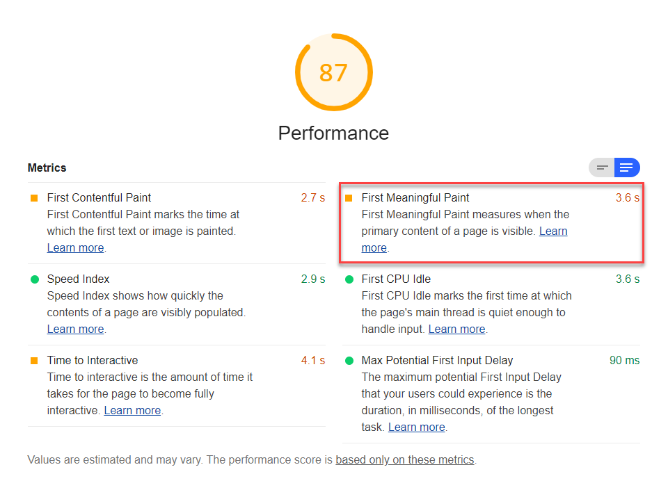

First Meaningful Paint (FMP) is one of six metrics tracked in the performance section of the Lighthouse report.
Each of these metrics captures some aspect of page load speed.
The Lighthouse reports displays the FMP time period in seconds:

<figure class="w-figure">
  
  <figcaption class="w-figcaption">
    First Meaningful Paint.
  </figcaption>
</figure>

## What does FMP measure

FMP measures when a user perceives that the primary content of a page is visible.
The raw score for FMP represents the time duration between the user initiating the page load
and the page rendering its primary content above the fold.
It's essentially the paint after which the biggest above-the-fold layout change has happened.
Learn more about the technical specifics of FMP in
[Time to First Meaningful Paint: a layout-based approach](https://docs.google.com/document/d/1BR94tJdZLsin5poeet0XoTW60M0SjvOJQttKT-JK8HI/view).

[First Contentful Paint (FCP)](/first-contentful-paint)
and FMP often share the same values
when the first bit of content rendered on the page includes the content above the fold.
These metrics can differ, say for example, when there's content above the fold within an iframe.
FMP registers when the content within the iframe is visible to the user.

## How Lighthouse determines your FMP score

In order to be able to calculate your overall performance score,
Lighthouse assigns each performance metric an individual score between 0–100.
FMP uses the [same real website performance data as First Contentful Paint (FCP)](https://httparchive.org/reports/loading-speed#fcp).

When FMP and FCP are the same time in seconds,
they share the same identical score.
If FMP is slower than FCP,
say when there's iframe content loading,
then the FMP score will be lower than the FCP score.

For example, let's say your FCP is 1.5 seconds, your FMP is 3.0 seconds.
The FCP score would be 99, but the FMP score would be 75.
This table helps explain how to interpret your FMP score:

  <table>
    <thead>
      <tr>
        <th>FMP metric (in seconds)</th>
        <th>Color-coding</th>
        <th>FMP score (FCP HTTParchive %-tile)</th>
      </tr>
    </thead>
    <tbody>
      <tr>
        <td>0–2 seconds</td>
        <td>Green (fast)</td>
        <td>75–100</td>
      </tr>
      <tr>
        <td>2–4 seconds</td>
        <td>Orange (average)</td>
        <td>50–74</td>
      </tr>
      <tr>
        <td>Over 4 seconds</td>
        <td>Red (slow)</td>
        <td>0–49</td>
      </tr>
    </tbody>
    <caption>FMP metric compared to FMP score.</caption>
  </table>

## How your FMP score impacts overall performance score

The overall Lighthouse performance score is a weighted-average of the performance metrics, including FMP, as well as,
[First Contentful Paint](/first-contentful-paint), [First CPU Idle](/first-cpu-idle), [Time to Interactive](/interactive), and [Speed Index](/speed-index).

Heavier-weighted metrics have a larger impact on the overall performance score.
FMP is weighted 1 out of 5, which means it has the lowest impact on the overall performance score
(see [Scoring Details](https://docs.google.com/spreadsheets/d/1Cxzhy5ecqJCucdf1M0iOzM8mIxNc7mmx107o5nj38Eo/edit#gid=0) for specifics).

Try also the [Scoring Calculator](https://docs.google.com/spreadsheets/d/1Cxzhy5ecqJCucdf1M0iOzM8mIxNc7mmx107o5nj38Eo/edit#gid=283330180) to get a better sense of how Lighthouse scoring works.

## How to improve your performance score

Improving your Lighthouse performance score
isn't so much about tackling one performance metric at a time,
but seeing page load speed more holistic.
Anything you do to improve page load speed, will improve not just one performance metric,
but quite likely all of these metrics.

The most effective way to improve your performance score
is to fix the load opportunities highlighted in your Lighthouse report.
The more significant the opportunity,
the greater impact it will have on improving your performance score.

<figure class="w-figure">
  
  <figcaption class="w-figcaption">
    Opportunities section.
  </figcaption>
</figure>

For example,
[Eliminate render-blocking resources](/render-blocking-resources)
shows opportunities to improve page load speed (in seconds).
Eliminate any one or all of the blocking resources, and not only will your FMP score improve,
but so will additional performance metrics, and your overall Lighthouse performance score.

Learn more about these potential savings from the [Performance audits landing page](/lighthouse-performance).

## Tracking FMP in the real world

To measure when FMP actually occurs on your users' devices,
see [Tracking FMP using hero elements](https://developers.google.com/web/fundamentals/performance/user-centric-performance-metrics#tracking_fmp_using_hero_elements).

See [Assessing Loading Performance in Real Life with Navigation and Resource Timing](https://developers.google.com/web/fundamentals/performance/navigation-and-resource-timing/)
for more on collecting real-user metrics with the User Timing API.
The [User Timing Marks and Measures Lighthouse audit](/user-timings)
enables you to see User Timing data in your report.

## More information

- [FMP audit source](https://github.com/GoogleChrome/lighthouse/blob/master/lighthouse-core/audits/metrics/first-meaningful-paint.js)
- [Lighthouse v3 Scoring Guide](https://developers.google.com/web/tools/lighthouse/v3/scoring)
- [Time to First Meaningful Paint: a layout-based approach](https://docs.google.com/document/d/1BR94tJdZLsin5poeet0XoTW60M0SjvOJQttKT-JK8HI/view)
