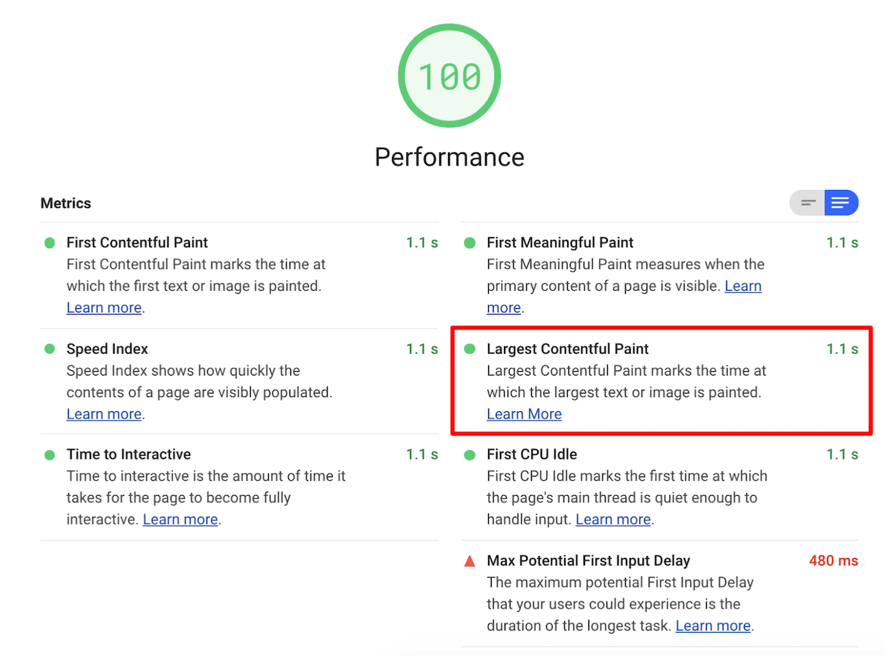

<!-- TODO https://web.dev/largest-contentful-paint already exists.
     What should the URL for this page be? -->

Largest Contentful Paint (LCP) is one of the metrics
tracked in the **Performance** section of the Lighthouse report.
Each metric captures some aspect of page load speed.

<!-- TODO update this depending on how the report displays LCP. Milliseconds? -->

Lighthouse displays LCP in milliseconds:

<!-- TODO update this once LCP lands in the report UI. -->

<figure class="w-figure">
  
</figure>

## What LCP measures

LCP measures when the largest content element visible in the viewport is
rendered to the screen. This approximates when the main content of the page is
visible to users. See [Largest Contentful Paint defined][definition] for more
details on how LCP is determined.

## How Lighthouse determines your LCP score

[Native support for LCP launched in Chrome 77][launch], so Lighthouse doesn't
need to calculate LCP. It just uses the [Largest Contentful Paint API][api] to get LCP
data from Chrome.

<!-- TODO explain how the LCP data is mapped to a score between 0 and 100. -->



## How to improve your LCP score

See [How to improve Largest Contentful Paint on your site][improve].

## Resources

- [Source code for **Largest Contentful Paint** audit](https://github.com/GoogleChrome/lighthouse/blob/master/lighthouse-core/audits/metrics/largest-contentful-paint.js)
- [Largest Contentful Paint](/largest-contentful-paint/)
- [Largest Contentful Paint API](https://wicg.github.io/largest-contentful-paint/)
- [New in Chrome 77: Largest Contentful Paint][launch]

[definition]: /largest-contentful-paint/#largest-contentful-paint-defined
[launch]: https://developers.google.com/web/updates/2019/09/nic77#lcp
[api]: https://wicg.github.io/largest-contentful-paint/
[improve]: /largest-contentful-paint#how-to-improve-largest-contentful-paint-on-your-site
