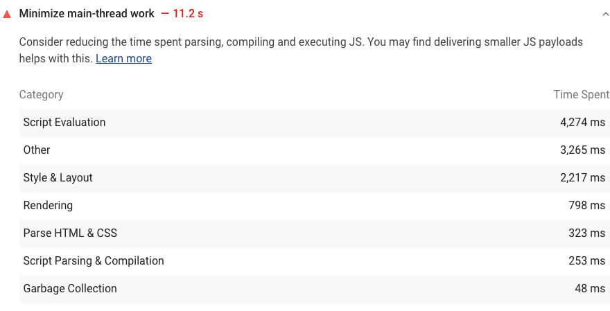

Lighthouse shows a breakdown of execution timings on the main thread
in the Diagnostics section:

<figure class="w-figure">
  
  <figcaption class="w-figcaption">
    Fig. 1 — Minimize main-thread work
  </figcaption>
</figure>

## How to improve execution timings on the main thread

Consider these tactics to reduce time spent parsing, compiling,
and executing JS:

- [Reduce JavaSdcript payloads with code-splitting](/reduce-javascript-payloads-with-code-splitting).
- [Remove unused code](/remove-unused-code).
- [Minify and compress netwwork payloads](/reduce-network-payloads-using-text-compression).

## More information

- [Minimize main-thread work audit source](https://github.com/GoogleChrome/lighthouse/blob/master/lighthouse-core/audits/mainthread-work-breakdown.js)
- [Reduce JavaScript payloads with code-splitting codelab](/codelab-code-splitting)
- [Minify and compress network payloads with gzip codelab](/codelab-text-compression)
- [Minify and compress network payloads with brotli codelab](/codelab-text-compression-brotli)